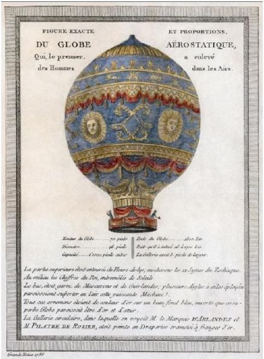
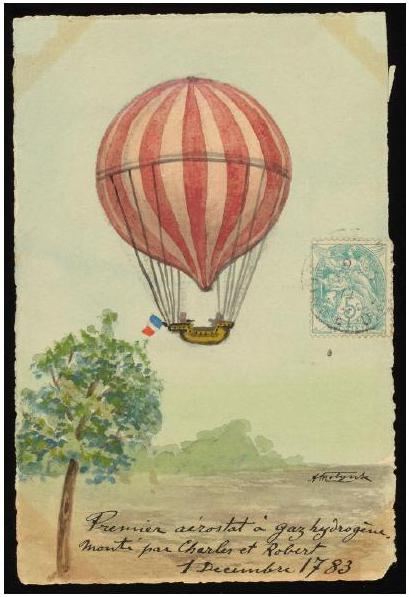
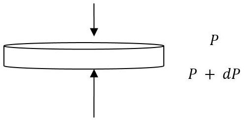

## Question 3

This question is about hot air balloons.

a) A hot air balloon rises when the upthrust is greater than its total weight. Calculate the volume of hot air required to lift a balloon with a combined mass of 200 kg for the balloon and basket. You should include the mass of the hot air, which has a density of $0.95 \mathrm{~kg} \mathrm{~m}^{-3}$ in the total weight of the balloon. The density of the cold air surrounding the balloon is $1.23 \mathrm{~kg} \mathrm{~m}^{-3}$.
b) In 1783, the Montgolfier brothers' hot air balloon freely ascended, but remained at a low height. The balloon had a volume of about $2000 \mathrm{~m}^{3}$, and a lifting capacity including its own weight of 830 kg. The air inside the balloon was heated by a fire in a basket below.
Estimate the temperature of the air in the balloon.
Air density at ground level is $1.23 \mathrm{~kg} \mathrm{~m}^{-3}$.
Surface atmospheric pressure is $1.01 \times 10^{5} \mathrm{~Pa}$.
The molar mass of air $0.029 \mathrm{~kg} \mathrm{~mol}^{-1}$.

Figure 6: credit: Wikipedia

c) Charles' and the Robert brothers' balloon flew not long after but was filled with hydrogen. The balloon had a capacity of $380 \mathrm{~m}^{3}$ and was filled on the ground at a sea level pressure of $1.01 \times 10^{5} \mathrm{~Pa}$, and temperature of 288 K.
    (i) Calculate the mass of hydrogen in the balloon.
    (ii) The balloon was constructed of a single lamina of rubberised silk with a thickness 0.43 mm. The silk cloth has a mass per unit area of $66.5 \mathrm{~g} \mathrm{~m}^{-2}$ and a density of $1.30 \mathrm{~g} \mathrm{~cm}^{-3}$. Rubber has a density of $1.34 \mathrm{~g} \mathrm{~cm}^{-3}$. Assuming the balloon is spherical, calculate the mass of the balloon to three significant figures.
    (iii) Taking the mass of the two passengers, gondola and rigging to be 270 kg, calculate the initial acceleration of the balloon at sea level.

Figure 7: credit: Wikipedia

The density of air at sea level is $1.23 \mathrm{~kg} \mathrm{~m}^{-3}$.

d) In an unrelated example, a balloon of mass $m_{1}$ with a small amount of ballast $m_{2}$ descends with constant velocity $v$ due to a drag force $F_{d}$ acting on the balloon. The drag force is proportional to the speed of the balloon through the air. What is the mass of ballast $m_{2}$, expressed in terms of $F_{d}$, that must be jettisoned from the balloon so that it rises with the same velocity $v$ ?

e) (i) Atmospheric pressure is due to the weight of air above.

Figure 8: Thin disc of atmosphere with a pressure difference due to the weight of the disc of air.

i. From the hydrostatic equation, $p=\rho g h$ we can can trivially write down an expression for $\Delta p$. This contains both $p$ and $\rho$ so you need another equation to eliminate $\rho$.
ii. From the ideal gas equation, obtain a relation between $p$ and $\rho, R, T$ and $M$, the molar mass.
iii. Now using the hydrostatic equation, obtain an expression for $\frac{d p}{p}$ in terms of $M, g, h, R$ and $T$.
iv. The temperature decreases linearly with height, in the form $T=T_{0}-\alpha h$. Use this with the previous result to produce an expression for atmospheric pressure as a function of altitude $p(h)$, in terms of sea level pressure $p_{0}, g$, the molar mass of air $M$, the molar gas constant $R$, the air temperature at sea level $T_{0}$, the rate of decrease of temperature with altitude $\alpha$ and altitude $h$. Humidity should not be considered.
(ii) In a second flight, Charles ascended to 3000 m . Calculate the ambient temperature and pressure at this altitude. Take the molar mass of air to be $0.0290 \mathrm{~kg} \mathrm{~mol}^{-1}$, and the molar gas constant to be $8.31 \mathrm{~J} \mathrm{~mol}^{-1} \mathrm{~K}^{-1}$. The rate of decrease of temperature with height is $0.00976 \mathrm{~K} \mathrm{~m}^{-1}$, the reference sea level temperature $T_{0}=288 \mathrm{~K}$ and the reference sea level pressure $p_{0}=1.01 \times 10^{5} \mathrm{~Pa}$.
(iii) The balloon expands in volume by $30 \%$ at a height of 3000 m .
    i. Calculate the pressure inside the balloon, assuming no hydrogen has been lost.
    ii. Determine the stress in the skin of the balloon.
    iii. Estimate the Young's Modulus of the composite skin material.

[25 marks]
