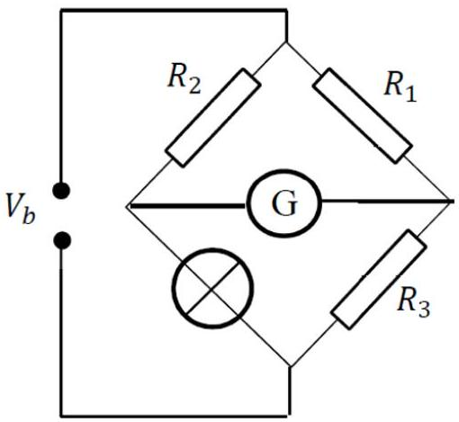
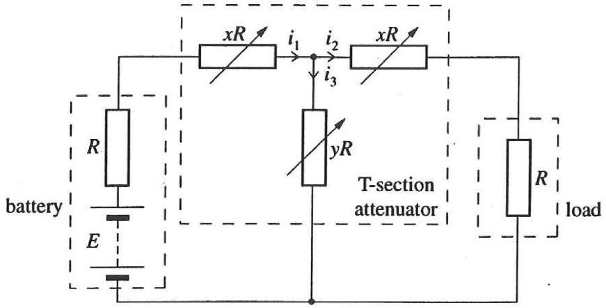
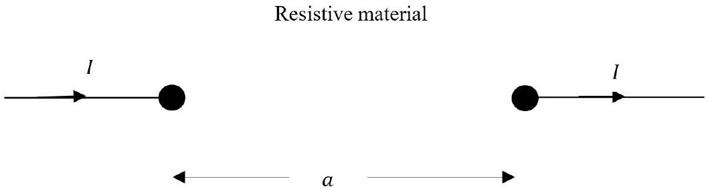

## Question 5

This question is about circuits.

a) A constant potential difference of 2.0 V is applied across the ends of a metal strip with the following dimensions: length 0.30 m, width 4.0 mm and thickness $10 \mu \mathrm{~m}$. The metal has a resistivity of $1.5 \times 10^{-7} \Omega \mathrm{~m}$ at $0{ }^{\circ} \mathrm{C}$ and a temperature coefficient of resistance of $\alpha=3.3 \times 10^{-3}{ }^{\circ} \mathrm{C}^{-1}$. The strip loses heat to its surroundings at a rate proportional to the surface area, and to the excess temperature above the surroundings $\theta$, which are at 0 °C. The constant of proportionality is $22 \mathrm{~W} \mathrm{~m}^{-2}{ }^{\circ} \mathrm{C}^{-1}$. Determine:
    (i) The resistance of the strip at $0^{\circ} \mathrm{C}$.
    (ii) The electrical power transferred when the strip is at 15°C.
    (iii) Write down expressions for the power converted as a function of excess temperature $\theta$, and for the rate of heat loss $P$ as a function of excess temperature $\theta$. Hence estimate the temperature reached after the current has been passing for a long period of time.
b) A tungsten filament lamp consists of a long, 25 cm filament supported at each end and in the middle. When operated using a 50 Hz supply there appeared to be four loops in the filament.
Estimate the tension in the filament given the density of tungsten is $19 \mathrm{~g} \mathrm{~cm}^{-3}$ ?
c) In a conductor of volume $V$, of uniform cross-section, made of a material of resistivity $\rho$, the current density is $J$ (the current per unit area normal to the flow). Find an expression in terms of $J, \rho$ and $V$ for the power dissipated as thermal energy.
d)The potential difference across a filament lamp, $V$, is related to the current $I$ through it by the relationship

$$
V=2 I+8 I^{2} .
$$

The lamp is connected to a measurement arm of the bridge circuit shown. Resistors $R_{1}, R_{2}$ and $R_{3}$ each have a resistance of $4.0 \Omega$.
Determine the potential difference $V_{b}$ such that no current flows through the galvanometer G.

Figure 12: A bridge circuit with a non-linear component.
e) The circuit of Fig. 13, includes an element known as a "T-section attenuator". The attenuator is used to adjust the power delivered to the load.
The attenuator is connected to a battery of $\operatorname{emf} E$ and internal resistance $R$, and to a load also of resistance $R$. The values of $x$ and $y$ are adjusted until the battery delivers maximum power.

Figure 13: A T-section attenuator circuit

(i) For this maximum power condition, obtain a relation between $x$ and $y$.
(ii) For the three currents $i_{1}, i_{2}, i_{3}$ shown in the circuit, obtain a general result for the ratio $\frac{i_{1}}{i_{2}}$ in terms of $x$ and $y$.
(iii) $P_{\text {input }}$ is the power delivered at the battery terminals and $P_{\text {load }}$ is the power dissipated in the load.
Show that $\frac{P_{\text {input }}}{P_{\text {load }}}=\frac{f(x)^{2}}{g(x)^{2}}$ where $f(x)$ and $g(x)$ are simple functions of $x$.

Hint; in a circuit of emf $E$ and internal resistance $r$ connected to a load resistance $R$, the condition for the battery to deliver maximum power to the load is when $R=r$.

f) A metal hemisphere of radius 0.1 m is immersed near the centre of a large conducting tank containing a liquid of resistivity $60 \Omega \mathrm{~m}$. The plane surface of the hemisphere is level with the surface of the liquid.
    (i) Find an expression for the resistance between two hemispherical shells within the liquid, concentric with the centre of the metal hemisphere, having radii $r$ and ( $r+$ $\delta r$ ) respectively.
    (ii) Hence calculate the resistance between the hemisphere and the tank.
    (iii) If the hemisphere is replaced by a sphere in a very large closed container of the liquid, what is the resistance between the sphere and the tank now?
    (iv) We now have two small conducting spheres each of radius $r$ separated by a distance $a$ where $a \gg r$, embedded in a resistive material of infinite extent, as in Figure 14. What is the resistance between them?
Hint: use the idea of superposition of currents in the material.

Figure 14: Two small spherical conductors embedded in a resistive material.
