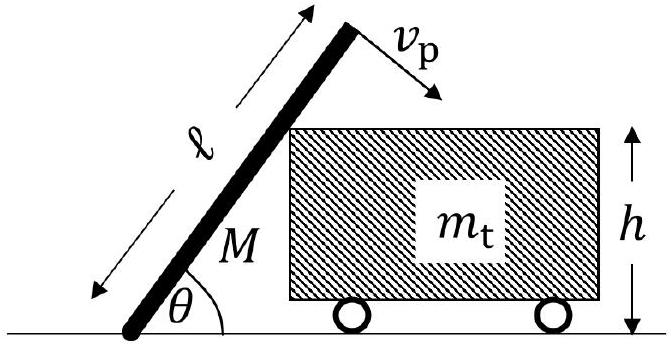
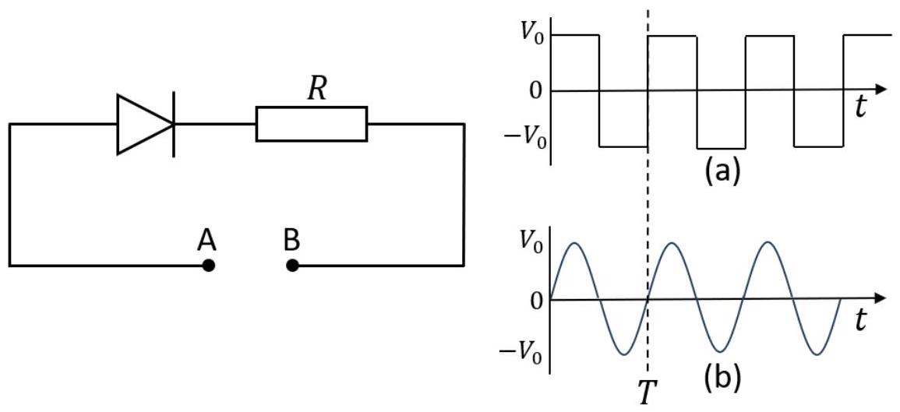
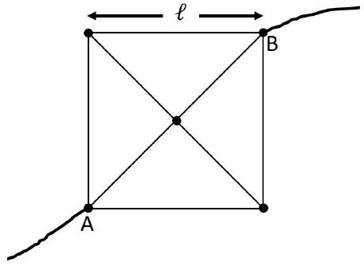
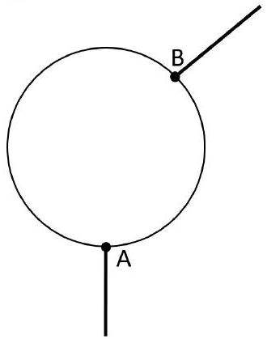
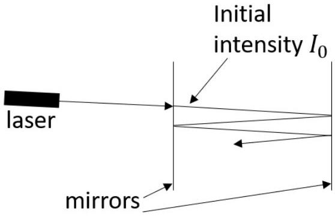

## Question 1

a) A stone is dropped from rest from a height of 5.0 m above the water surface of a pool. After hitting the water, it sinks to the bottom, 4.0 m below the surface. If it sinks with the same speed as it struck the water, for how long is the stone in motion?

b) The Earth orbits the Sun at a distance of 8.0 light minutes away. The Sun lies at a position in the Milky Way galaxy at about 8.3 kpc from the centre. The galaxy rotates about the galactic centre with an orbital period of 240 million years. What is the value of the orbital speed of the Solar System in the galaxy divided by the orbital speed of the Earth about the Sun?
$1.00 \mathrm{pc}($ parsec $)=3.26$ light years

c) A spring with spring constant, $k$, sits on the floor of of an elevator with a mass $m$ resting on top. The elevator then accelerates upwards and uniformly from zero to $18 \mathrm{~m} \mathrm{~s}^{-1}$ in 6 s . What is the ratio $\frac{\Delta \ell_{1}}{\Delta \ell_{2}}$, where $\Delta \ell_{1}$ is the initial contraction in length of the spring when the lift is stationary, and $\Delta \ell_{2}$ is the contraction measured when the lift is accelerating?

d) A mass $m$ hangs from the end of a light string of length $\ell$, which is attached to a point on the ceiling. It is set in motion so that the mass moves in a horizontal circle of radius $r$ with the string at angle $\theta$ to the vertical as it traces out the curved surface of a cone.
    (i) By resolving the forces on the mass, obtain an expression for the period of orbit, $T$, of the mass, in terms of $r, g$ and $\tan \theta$.
    (ii) Substitute for $\tan \theta$ to express the period of orbit in terms of $\ell, g$ and $\cos \theta$.

e) A light lever in the form of a letter L, with arms $\mathrm{AB}, \mathrm{BC}$ of lengths $a, b$, is smoothly pivoted at B so that it can turn in a vertical plane. Masses $m_{a}$ and $m_{b}$ are attached at A and C respectively. In an equilibrium position, the inclination of AB to the vertical is given by angle $\theta$. Obtain an expression for $\theta$ in term of $m_{a}, m_{b}, a$ and $b$.

f) A heavy uniform plank of length $\ell$ and mass $M$, is fixed to the ground at its lower end by a smooth hinge. Initially, it stands upright next to a stationary trolley of mass $m_{\mathrm{t}}$ and height $h$, as shown in Fig. 1. The plank is disturbed and it tips over, pushing the trolley along horizontally with the smooth flat surface of the plank pushing the top rear corner of the trolley.
When the plank is falling over, the top end swings in a circle at speed $v_{\mathrm{p}}$, such that the plank's rotational kinetic energy about the pivot at the lower fixed end is given by $\frac{1}{6} M v_{\mathrm{p}}^{2}$. At the moment the top of the plank reaches the top corner of the trolley, obtain an expression for the speed of the trolley, $v_{\mathrm{t}}$, in terms of $g$ and $h$, given $M=\frac{m_{\mathrm{t}}}{2}$ and $\ell=3 h$. Neglect friction in this question.

Figure 1: A smooth plank falling over and pushing the top corner of a trolley along a frictionless horizontal surface.

[4]

g) A rocket testing machine consists of a track of length $d$, along which a rocket can accelerate uniformly from rest at $15 \mathrm{~m} \mathrm{~s}^{-2}$ up to the end point, where a set of brakes rapidly brings it to rest in a negligible time. It is then drawn back to the start at a constant speed of $v_{c}=12 \mathrm{~m} \mathrm{~s}^{-1}$. If the time taken from firing the rocket to its return to the starting point is 48 s, what is the length of the track, $d$ ?
[6]
h) The displacement $y$ of a point in an elastic medium when a wave passes through depends on the time $t$ and the location $x$ of the point, relative to the starting time and the origin. The displacement is obtained from the phase of the wave at that point, which is the sum of the phases due to the time increment and the relative distance from the origin. The displacement of a point at $x$ and $t$, is given by
$$
y=4.0 \times 10^{-6}(\mathrm{~m}) \cos \left(1800 \frac{t}{(\mathrm{~s})}+5.72 \frac{x}{(\mathrm{~m})}\right)
$$
(Units are given in brackets)
    (i) Determine the amplitude, frequency, wavelength, and speed of the wave.
    (ii) What is the maximum speed of motion of the point in the medium?

i) Beats are produced when two waves of similar frequencies interfere, causing slowly varying constructive and destructive interference. If the frequencies differ by 1 Hz then the constructive to destructive to constructive interference will occur once each second, giving a beat frequency of 1 Hz.
A siren producing a note of 256 Hz and an organ pipe of slightly lower frequency full of air at 17 °C, when played together give a beat frequency of 4 Hz. On slowly changing the temperature of the air in the pipe, the beat frequency first reduces to zero and then increases again to 4 Hz. what is the change in temperature of the air in the pipe?
The speed of a wave in air is given by $v=\sqrt{\frac{\gamma P}{\rho}}$ where $\gamma$ is a numerical constant, $P$ is the pressure and $\rho$ is the density of the air. $\square$
j) Pure water can be cooled down to -10 °C without freezing. If a small piece of ice is dropped into this supercooled water held in a thermally insulated container, some of the water immediately freezes. What fraction will freeze?
$$
\begin{aligned}
& L_{\text {ice }}=335000 \mathrm{~J} \mathrm{~kg}^{-1} \\
& c_{\text {water }}=4180 \mathrm{~J} \mathrm{~kg}^{-1}{ }^{\circ} \mathrm{C}^{-1}
\end{aligned}
$$ $\square$
k) A circuit with an ideal diode in series with a resistor $R$ is shown in Fig. 2. Two supply voltages each with amplitude $V_{0}$ and frequency $f=\frac{1}{T}$ are also shown: in (a) as a square wave, and (b) a sinusoidal variation with time. Obtain expressions for the average power dissipated in the resistor $R$ for
    (i) the square wave signal shown in (a), and
    (ii) for the sinusoidal variation shown in (b).

1) A uniform wire of resistance per unit length $r$ is formed into a square of side $\ell$, with diagonals that are connected at the centre. This is shown in Fig. 3.
Obtain an expression for the resistance between points A and B at the corners of the square, in terms of $r$ and $\ell$. Give you answer in surds.

Figure 3: Wires connected to form a square with diagonals, with connection leads at A and B.

[3]

m) A length of resistance wire of diameter 1.4 mm and resistivity $3.0 \times 10^{-4} \Omega$ m is bent to form a circle, as shown in Fig. 4. The radius of the circle is 10 cm. Two conducting wires are connected at points A and B, such that the contact B can slide around the circle.

(i) Calculate the maximum resistance that can exist between A and B.
(ii) Sketch a graph of the resistance between A and B against the arc length measured from A as contact B is slid from A around the circle and back to A on the other side.
(iii)What is the shortest length of the arc between A and B such that the resistance between A and B is $22.0 \Omega$ ?

Figure 4: A wire bent into the shape of a circle with contacts at A and B. B can slide around the circle.

[6]
n) Before a device is fully charged, the current flowing into it at a time $t<t_{\text {fully charged }}$ is given by
$$
I=I_{0}-\alpha t
$$
where $I_{0}$ is the initial current.
    (i) How long does it take to charge it, and
    (ii) how much charge is accumulated?

o) A cone of circular cross section sits in a liquid of density $\rho_{\ell}$ with apex pointing down and its base level with the surface of the liquid. The density of the cone varies linearly along its length. The base of the cone has a density $\rho_{\mathrm{b}}$ half that of the liquid. What is the ratio of the density of the apex, $\rho_{\mathrm{a}}$, to the density of the liquid?
p) An elastic material called neoprene is used within sections of motorway roads in hot countries to maintain a flat road with no discontinuities under different temperatures. If we have a road built with 2.0 cm of neoprene placed between every 20 m lengths of concrete, and the concrete has a thermal expansion coefficient of $\alpha=12 \times 10^{-6} \mathrm{~K}^{-1}$, what is the highest temperature it can go up to before the road cracks?
Assume that the elastic material is initially under no deformation at a temperature of 20 °C.
Thermal expansion coefficient $\alpha$ is specified by $\ell=\ell_{0}(1+\alpha \Delta T)$ in which $\ell$ is the expanded length, $\ell_{0}$ the initial length, and $\Delta T$ the temperature rise.
Young's Modulus of neoprene $=2.7 \mathrm{MPa}$
Breaking stress of concrete $=30 \mathrm{MPa}$

q) A laser beam that entered the region between two infinite ideal mirrors would reflect an infinite number of times between them, as shown in Fig. 5. However, mirrors in real life have a reflectivity constant $R$ which is the fraction of the incident energy that is reflected, meaning $1-R$ of the energy will be transmitted (i.e. pass through the mirror). If the initial beam energy between the mirrors is $I_{0}$, what is the ratio of the total energy escaping through each mirror?

Figure 5: A pair of parallel mirrors with a beam of initial intensity $I_{0}$ reflected between them. (The beam has been shown at a small angle for clarity.)

r) In a closed tube of length $l$ cross-section area $A$ there is a volume of high pressure gas $P_{1}$ and an equal volume of low pressure gas $P_{2}$ separated by a diaphragm in the centre of the tube. The tube is uniformly heated from $T_{0}$ until the diaphragm bursts, which occurs when a maximum force $F$ is applied. After a moment the pressure equalises in the tube, which is now insulated from the surroundings so that no thermal energy is lost.
What is the final pressure inside the tube?
