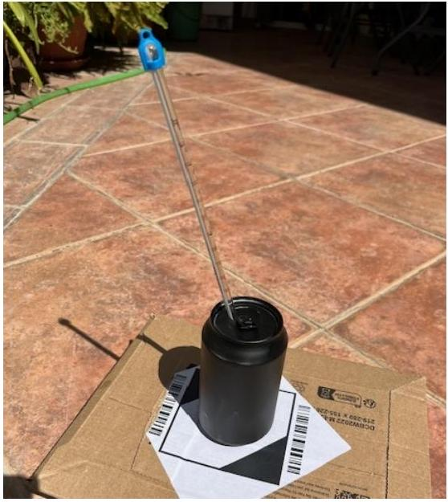
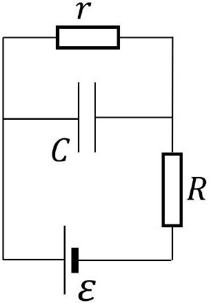
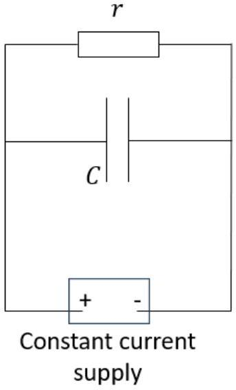

## Question 2

This question is about solar energy, energy losses and capacitors.

a) A simple experiment to estimate solar power output is conducted by a student on a clear sunny day in Spain.
The setup is shown in Fig. 1, and consists of a thin aluminium walled matte black can filled with 300 g of water. A thermometer, fitted through a small hole in the black painted lid, measures the temperature of the water. The can, lid, water and thermometer are allowed to come to ambient temperature in the shade, before being placed on an insulating surface in full sunlight.

Figure 1: A water filled can with a lid and thermometer, sitting on an insulated base in the sunshine.

After 20 minutes, the temperature of the water in the can has risen from 27.0 °C to 30.0 °C. The angle of the sun to the horizontal is 50°. The can has a diameter of 6.0 cm and a height of 10.0 cm.
Neglecting the heat capacity of the can, lid and thermometer, calculate a value for the intensity ( $\mathrm{W} \mathrm{m}^{-2}$ ) of the Sun's radiation.
Ignore energy losses from the can. Assume that the can and lid absorb all of the incident radiation. $\square$
b) (This part is about the capacitor circuit only, which is a model). A student believes that it might be possible to model the behaviour of the energy transfer above, by considering the can of water to be a capacitor being charged up with charge $Q$, and the energy losses to be a leak of current across the capacitor as shown in Fig. 2. We can determine the time constant for the circuit shown in terms of $r, R$ and $C$.

Figure 2: Circuit with a "leaky" capacitor.

(i) Write down the potential around the circuit, in terms of $\varepsilon$, the current $I$ through $R$, and the potential across the capacitor from $C$ and its charge, $Q$.
(ii) Now write down the current through $R$ (and the cell), $I$, in terms of the current through $r$ (using the potential on $C$ ) and the current flowing onto $C$, both in terms of $Q$.
(iii) Hence write an equation for $\varepsilon$ in term of $\frac{\mathrm{d} Q}{\mathrm{~d} t}$ and $Q$.
(iv) What is the expression for the time constant $\tau$ of this capacitor circuit? (You may read this off the differential equation without doing any integration).
(v) By observation of the circuit diagram rather than an equation, what would be the steady state (equilibrium) charge, $Q_{\mathrm{ss}}$, on the capacitor after a long time, in terms of $R, r, \varepsilon$ and $C$ ?
(vi) Sketch a graph of the charge on the capacitor against time, marking on $\varepsilon$ and $Q_{\mathrm{ss}}$.
c)Since the power reaching the can of water is constant, in our model the cell in the Fig. 2 is replaced with a constant current supply (the device adjusts the voltage output to maintain a specified current). The circuit becomes that of Fig. 3, in which the source current is $I_{0}$.

Figure 3: Circuit with a "leaky" capacitor and constant current supply.

    (i) After a long time, the circuit of Fig. 2 will reach a steady state. By observation of the circuit diagram what will be the maximum charge on the capacitor, and its energy stored, in terms of $I_{0}, r$ and $C$ ?

The rate of flow of charge to the capacitor is analogous to the rate of increase in internal energy of the water in the can. The current through the resistor $r$ is analogous to the power lost to the surroundings, given by $P_{\text {leak }}=k T$, where $T$ is the temperature difference between the water in the can and the surroundings and $k$ is a constant.

(ii) Write down an equation for the power absorbed by the can, $P_{\text {can }}$ in terms of the rate of temperature increase of the water, the specific heat capacity of the water $c$, the mass of water $m$, the temperature excess $T$ and $k$.

(iii) Using your result from part (ii), what is the simple expression for the steady state result for $P_{\text {can }}$ ?
(iv) Calculate the value of $k$ given that over 40 minutes the temperature of the can falls from 34.2 °C to 32.8 °C in an ambient temperature of 31.0 °C.
(v) Produce a new estimate for the power output of the Sun, this time accounting for energy losses from the can.
d) The solar constant is the intensity of the Sun's radiation at the top of the atmosphere, normal to the radial line between the Earth and the Sun and has a value of $1360 \mathrm{~W} \mathrm{~m}^{-2}$. The Sun lies at a distance of $1.5 \times 10^{11} \mathrm{~m}$ from the Earth and has a radius of 696000 km .
    (i) What is the power produced on average per cubic metre within the Sun?
    (ii) Using the equation of mass-energy equivalence, $E=m c^{2}$, estimate how much mass the Sun loses each second through radiation.
