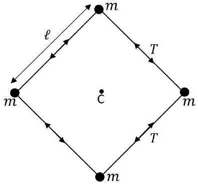
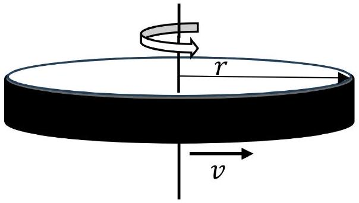
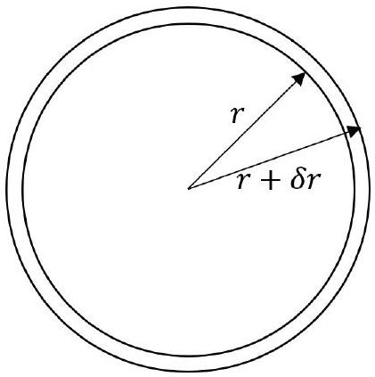

## Question 3

This question is about bubbles, forces and rotation.

a) A spherical soap bubble is filled with warm air but, due to the weight of the liquid film, the bubble sinks slowly at speed $v$ in the surrounding cooler air. As the soap film evaporates, the bubble becomes lighter and eventually starts to rise. We wish to determine the length of time it takes between it falling at speed $v$ in still air and then, a short time later, the bubble rising in still air at speed $v$.

Figure 4: A bubble floating in air. The heavier (sinking) and lighter (rising) masses of the bubble are $m_{\mathrm{h}}$ and $m_{\ell}$ respectively.
The bubble has a radius $r=8.0 \mathrm{~cm}$, the density of the soap solution is $998 \mathrm{~kg} \mathrm{~m}^{-3}$, and the soap film evaporates from the outer surface at a rate of $2.4 \times 10^{-5} \mathrm{~kg} \mathrm{~m}^{-2} \mathrm{~s}^{-1}$.

(i) Using the fact that the magnitude of the drag force, $F_{\mathrm{d}}$, is the same when the bubble is falling as when it is rising, obtain two equations, for the buoyancy, $B$, and for $F_{\mathrm{d}}$, acting on the bubble in terms of $m_{\mathrm{h}}, m_{\ell}$ and $g$.
(ii) Calculate the magnitude of the buoyancy force, when the air inside is at 25 °C and the cooler air in the room is at $17{ }^{\circ} \mathrm{C}$. Take atmospheric pressure as $1.01 \times 10^{5} \mathrm{~Pa}$ and the molar mass of the air inside and outside to be to be $28 \mathrm{~g} \mathrm{~mol}^{-1}$.
Ignore the extra pressure due to the soap film, and the water vapour inside the bubble.
(iii) The slow speed of motion means that $F_{\mathrm{d}}=k v$ with $k=1.2 \times 10^{-3} \mathrm{Ns} \mathrm{m}^{-1}$. Calculate how long it would take for sufficient mass of the soap film to have evaporated from the outside surface of the bubble so that the velocity changes from $6.0 \mathrm{~cm} \mathrm{~s}^{-1}$ downwards to $6.0 \mathrm{~cm} \mathrm{~s}^{-1}$ upwards.
(iv) Calculate the initial thickness of the bubble wall.
b)(i) Four identical masses, $m$, are attached to each other by four light strings of equal length $\ell$, as in Fig. 5.

Figure 5: Deriving the tension in a rotating set of masses.

The system rotates in the plane of the masses about the centre C , with each mass moving at speed $v$ in a circle.
Obtain expressions for the radial $T_{\mathrm{r}}$ and tangential $T_{\text {tangential }}$ components of the tension $T$ in the string, in terms of $m, v$ and $\ell$.

When the masses are not discrete but continuous, a modified approach is used.
(ii) A thin circular hoop of mass $m$ and radius $r$ is rotated in a horizontal plane about its centre with speed $v$ as in Fig. 6. The hoop has a mass per unit length (linear density) of $\lambda$.

Figure 6: A thin hoop rotating at speed $v$. The tension $T_{\text {tangential }}$ in the hoop prevents it breaking apart as it rotates.

The tension $T_{\text {tangential }}$ in the hoop holding it together is given by the expression

$$
T_{\text {tangential }}=k \lambda^{\alpha} v^{\beta} r^{\gamma}
$$

where $k$ is a dimensionless quantity. By considering the dimensions (or units) of the terms in this expression, and assuming $k=1$, obtain an equation for $T_{\text {tangential }}$.

(iii) A rubber band of mass 25 g which behaves linearly, has an unstretched length of 15.0 cm and a spring constant of $2000 \mathrm{~N} \mathrm{~m}^{-1}$. It is stretched round a horizontal flywheel (a disc) of circumference 18.5 cm . At what speed of rotation of the disc will the band fall off?

c)A thin, elastic ring of mass $m$ and radius $r$ of Fig. 7 oscillates at its lowest natural frequency in a radial direction, expanding and contracting. The circumferential tension in the ring is proportional to the extension of the circumference i.e. $T=k \delta x$ where $\delta x$ is the extension of the ring circumference and $k$ is a constant. Determine an expression for frequency, $f$, of radial oscillations in terms of $\lambda$ (the mass per unit length), $r$ and $k$.

Figure 7: Radial oscillations of a ring.
