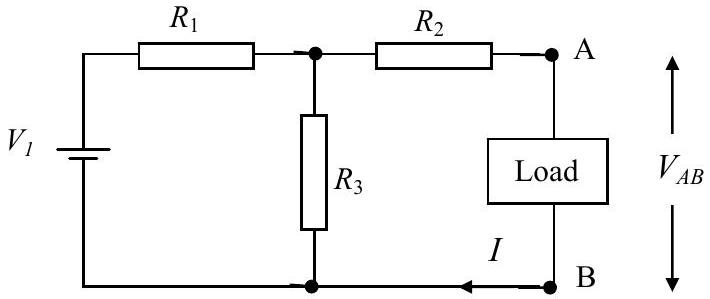
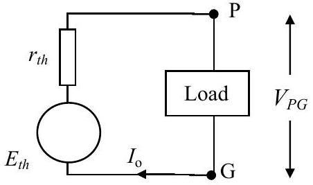
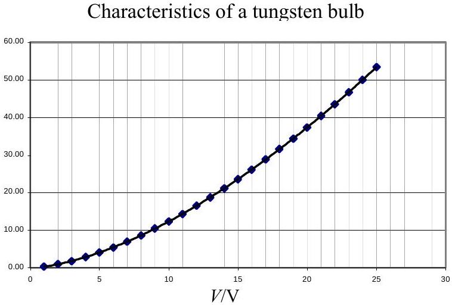
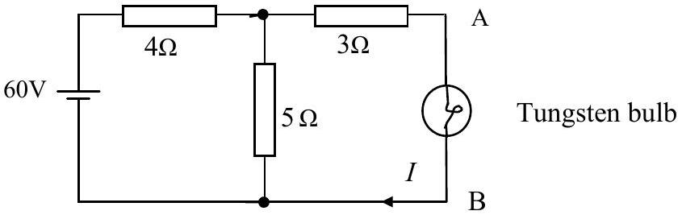

Q3

a) Figure 3.1a

Figure 3.1b

Figure 3.1a shows a circuit with three resistors, a load and one cell. Figure 3.1b shows a simplified circuit, where the three resistors have been replaced by a single resistor and the cell by a different cell. If $V_{\mathrm{AB}}=V_{\mathrm{PG}}$ and $I=I_{o}$. then show that this requires:

$$
E_{t h}=\frac{V_{1} R_{3}}{R_{1}+R_{3}} \text { and } r_{t h}=R_{1}+\frac{R_{2} R_{3}}{R_{2}+R_{3}} \text {. }
$$

b) Figure 3.2

Figure 3.3

Figure 3.2 shows the power $(P) /$ P.D. $(V)$ characteristics of a nominal $24 \mathrm{~V}, 50 \mathrm{~W}$, bulb. These are the normal operating values. Figure 3.3 shows the circuit into which has been inserted. The equation of the curve in Figure 3.2 is $P=0.309 V^{1.6}$. Use an equivalent circuit (as in 3.1b) to find the current $I$ in the bulb and the power $P$ dissipated in the bulb.

If you use programmable functions on your calculator you must explain in detail your solution.
State and use simple assumptions to show that $P^{5} \propto V^{8}$ is the expected relationship for a pure tungsten filament bulb.
