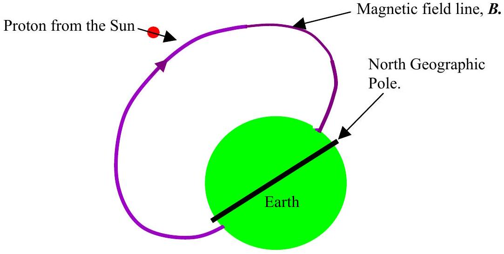
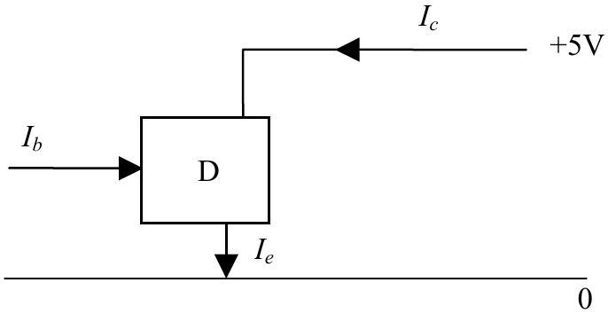
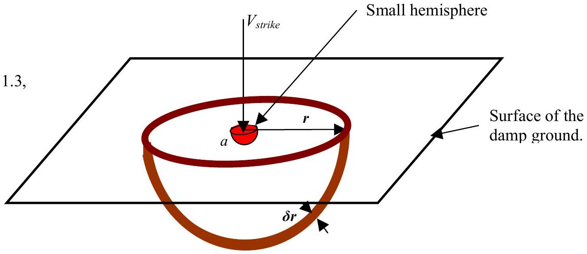

Q1
In this question you are asked to make reasoned estimates and assumptions. These must be clearly stated.
a)

(i) Foolishly I turn on the shower tap when the showerhead is resting on the floor - the flexible pipe thrashes around like a berserk snake. Explain this behaviour. [2]
(ii) The garden hose is 50 m long and connected to a tap. It is then turned on. I partially close the hole emitting the water. The water spurts out faster. Why? [2]
(iii) How could I measure the increased speed of the water - I only have a metre rule? [2]
b) 
(i) Figure 1.1 shows a cross-section of the Earth and a typical magnetic field line. A proton from the Sun is shown approaching the Earth. Sketch the path of the proton. What effects may be observed when these protons reach the atmosphere of the Earth. [2.2]
    (ii) A charged particle, mass $m$, charge $q$, travelling in a circle radius $r$ in a magnetic field $\boldsymbol{B}$ at right angles to the plane of the circle emits electromagnetic radiation of frequency $f$, where $f$ is given by
$$
f=\frac{B q}{2 \pi m} .
$$
Show that this is equal to the rotational frequency of the charged particle rotating in a plane at right angles to the direction of motion. [2]
    (iii) The speed of the proton is $2.1 \times 10^{5} \mathrm{~m} \mathrm{~s}^{-1}$ and the magnetic field density, $\boldsymbol{B}$, is $1.0 \mu \mathrm{~T}$. Calculate the frequency of electromagnetic waves given off. [1]
c) Figure 1.2

Figure 1.2 shows the circuit diagram needed to test a three terminal device, D. It is found that within the working limits of the device that:
$$
I_{c}=k I_{b},
$$
where $k$ is a constant. The formula holds only if $I_{b}>0$.

(i) Write down a relationship between the three currents.
(ii) How would you modify the circuit so that a small changing $\mathrm{pd} \pm \delta v_{\text {in }}$, (where $\left.\delta v_{\text {in }} \ll 5 V\right)$ gave a much larger changing pd, $\delta v_{\text {out }}$, out?

d) According to the kinetic theory of gases for a perfect gas:
$$
p=\frac{1}{3} \rho c^{2},
$$
where $p$ is the pressure of the gas, $\rho$ is the density of the gas and $c$ is the root mean square velocity of the gas molecules.
Find an expression of the rate of leakage of a gas from a small hole, cross-sectional area $a$, in a cubic container, side $l, l \gg \sqrt{a}$. $\square$
A cylinder that contains helium has a diameter of 300 mm and a length of 1.5 m. The pressure of the gas in the cylinder is 10 atmospheres above the ambient air pressure. There is a small hole in the piston, diameter 2 mm. Calculate the rate of fall of pressure in the cylinder assuming that the expansion is isothermal. $\square$
e) 
Figure 1.3 shows a diagram of a theoretical model of lightening striking damp ground. The constant potential of the small central hemisphere, radius $a$, is $V_{\text {strike. }}$ At a very long distance away, from the region where the lightening strikes the Earth, the potential of a point in and on the Earth is zero. The radius of the hemisphere in Figure 1.3 is $r$ and a thin hemispherical shell, radius $r$, is of thickness $\delta r$. You can assume that the specific resistivity of the damp earth is much less than that of the air and that the current flows radially through the hemisphere. Spherical symmetry is to be assumed on and below the ground.
Sketch graphs (i) the current density $\sigma$, (ii) the potential gradient $E$, against $r$ the radial distance from the centre.
Show that for a small change in $r, \delta r$, there is a small change in potential $\delta V$, given by:
$$
\delta V=-\frac{K \rho}{2 \pi r^{2}} \delta r,
$$
where $\rho$ is the specific resistivity of the earth $(\Omega \mathrm{m})$ and $K$ is a constant. What is the physical significance of $K$ ? $\square$
Hence or otherwise find an expression for the potential with distance from the centre of the strike and sketch $V(r)$ against $\boldsymbol{r}$. $\square$
In one newspaper report it was stated that lightening struck a field in which there were a herd of cows, and most cows were killed. However in another incident lightening struck a rugby pitch whilst a game was in progress. All, but one, of the players were uninjured, though shocked. The injured man recovered. Suggest a physical reason for the different medical effects in the two incidents. $\square$
