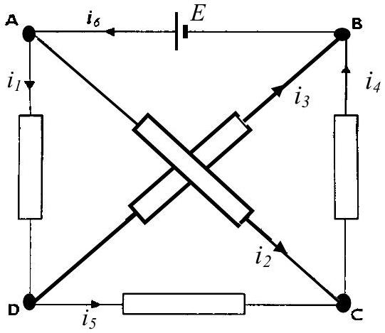
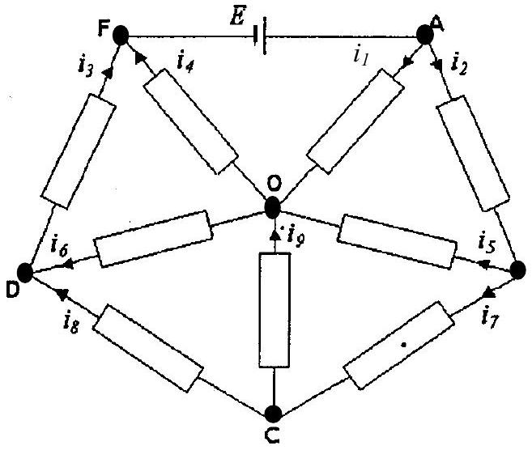

Q2
a) How do the electrical currents in the arms of a network, containing resistors and batteries, alter if the connections to all the batteries are reversed?
b) In Figure 2.1 all the resistors have resistance $R$ and the cell has an emf of $E$. The currents indicated in the arms are $i_{1}, i_{2}, i_{3}, i_{4}, i_{5}$, and $i_{6}$.
(i) By reversing the polarity of the battery terminals deduce, using a symmetry argument, two relationships between the currents.
(ii) Show that $i_{1},=0$.
(iii) Determine $i_{1}, i_{2}$ and $i_{6}$.

Figure 2.1

c) Figure 2.2

In the circuit shown in Figure 2.2, all resistors have a resistance $R$

(i) By reversing the polarity of the battery terminals deduce, with appropriate explanation, relations between the currents.
(ii) Determine a value of $i_{1}$ in terms of $E$ and $R$.
(iii) Calculate the total resistance $X$ across the cell in terms of $R$.
