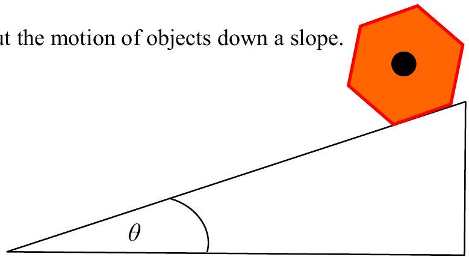
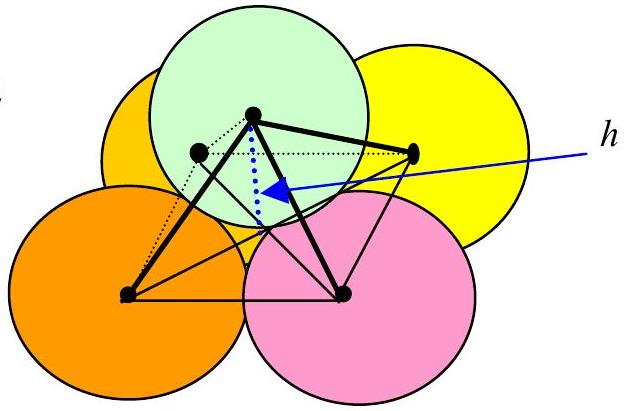
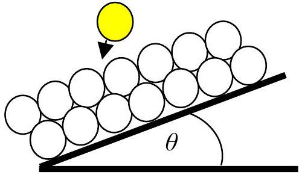

Q4

(a) Figure 4.1 shows the cross-section of a slope on which a pencil rests. The pencil is hexagonal in cross-section. Find the angle, $\theta$, of the slope, at which the pencil will tend to roll down the slope.
(b) The pencil could slip. Find the value of $\theta$ at which the pencil will slide if the coefficient of friction between the surfaces is $\mu$.
(c) Consider a cylindrical object that has a cross-section in the form of a polygon with $N$ equal sides. Find the algebraic condition such that if $\mu$ is greater than a certain value the object will roll rather than slip.

(d)

Figure 4.3

Two layers of identical spheres are arranged so that each sphere forming the upper layer sits on top of four other identical touching spheres arranged with their centres at the corners of a square, Figure 4.2. Calculate the separation of the planes through the centres of the spheres, $h$, in terms of the diameter of the spheres, $d$.
(e)
In practice it is found that piles of rough objects are conical and the angle that the face of the cone makes with the horizontal is about 33°.

Consider a simple two layer model as shown in (d). A slope, (angle $\theta$ with the horizontal), is constructed of two layers of spherical particles, Figure 4.3. A spherical particle is displaced and lands on the slope such that it drops symmetrically between four other particles, as in Figure 4.3, at a speed $v$. On impact it loses 50\% of its KE. Calculate the smallest value of $\nu$ so that it continues to bounce down the slope. What criticism can be made of this model and its ability to predict the behaviour of non-attracting particles?
(f) Clay slopes are never stable. Suggest a reason for this. [20]
