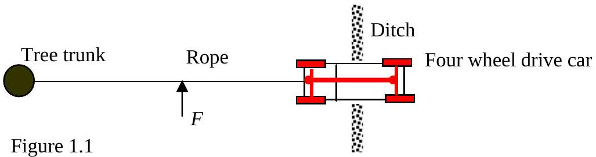
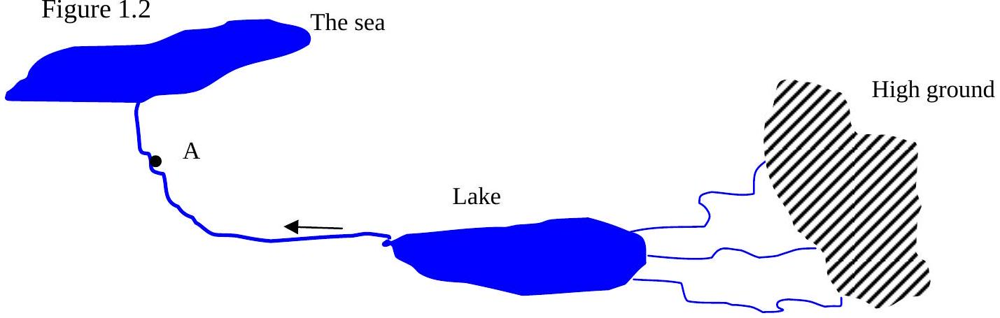

Q1
In this question you are asked to make reasoned estimates and assumptions. These must be clearly stated.

a) (i) Large print heading in the National Geographic Magazine reads: "Olivine is sharper than steel". Comment and explain. Note olivine is a very hard glass-like volcanic rock.

(ii) A motorist gets his car stuck in a ditch Figure 1.1. He is advised to attach a rope to a tree trunk, tighten it, and push the rope with a force $F$ at right angles to the rope. When the car has moved, he repeats the above procedure. Explain why this procedure is more effective than simply pulling the rope without bothering to use the tree trunk
(iii) A razor, whether electric or manual, needs to be sharp in order to be comfortable when used. Why is this?
(iv) A stationary mass of 0.5 kg is hit by a 2 kg hammer that is moving at a speed of $1.3 \mathrm{~ms}^{-1}$. If the collision is perfectly elastic calculate the subsequent speed of the mass. Since the hardness of the hammer does not enter into the calculation one might as well use a rubber hammer to drive in a nail. Comment.
b)Table 1 shows the timetable of a passenger boat on the river Rhine.

| Time | Town | Time Town | Position along the river/km |
| :--- | :--- | :--- | :--- |
| 1700 | St Goarhausen | 1851 St Goarhausen | 642 |
| 1830 | Bacharach | 1801 Bacharach | 659 |

Table 1.

Obtain a numerical estimate for the speed of the Rhine current and the speed of the boats in still water. N.B the position marks follow the river Rhine indicating the distance, along its course, from a zero mark.

c) 
It is desired to make an analogue electrical circuit that will replicate the behaviour of the mountain, lake, river system, Figure 1.2. Draw an electrical circuit, analogue, and explain how the circuit may be used, to indicate the rate of rise of river level at A due to sudden rainfall on the high ground.
d) The distance from the centre of the Earth to the poles is 21 km shorter than the radius of the equator. A one second pendulum is taken from the equator (at sea level) to the North Pole. Make a rough estimate of its change in period. You may assume for the purposes of your calculation that the Earth has a constant density.
e) When a perfect monatomic gas expands adiabatically (no heat interchange with its surroundings) the pressure and volume of the gas are related by the formula:
$$
P_{1} V_{1}^{\gamma}=P_{2} V_{2}^{\gamma},
$$
where $\gamma$ in this case is 5/3 and $P_{1}, V_{1}, P_{2}, V_{2}$ refer to the initial and final states of the volume and pressure of the gas . A helium balloon at atmospheric pressure is allowed to rise rapidly to a height such that the external pressure is half atmospheric pressure. The envelope of the balloon is at all times loose, of negligible mass, and regarded as a perfect heat insulator.
    (i) Calculate the ratio of the initial to final volume of the balloon.
    (ii) If the initial temperature of the gas was 300 K , what will be its new temperature?
f) During the 1998 International Olympiad in Iceland competitors and leaders were surprised to see a cone of snow in the sea on the North West horizon. This was the mountain of Snaefell that is about 2000 m high. However only the top 800 m of the mountain could be seen. The mountain is about 120 km from Rekjavik. Use these values to estimate the radius of the Earth.
g) (i) How do tsunamis arise?
    (ii) What is the order of magnitude of the wavelength, speed and amplitude of the wave in the deep ocean?
        (iii) How do these change when they approach land?
