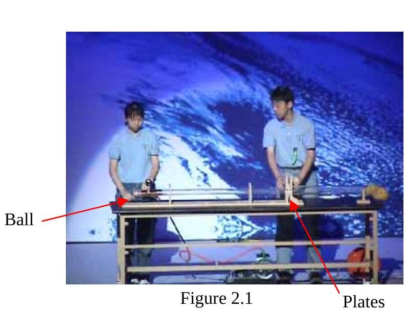
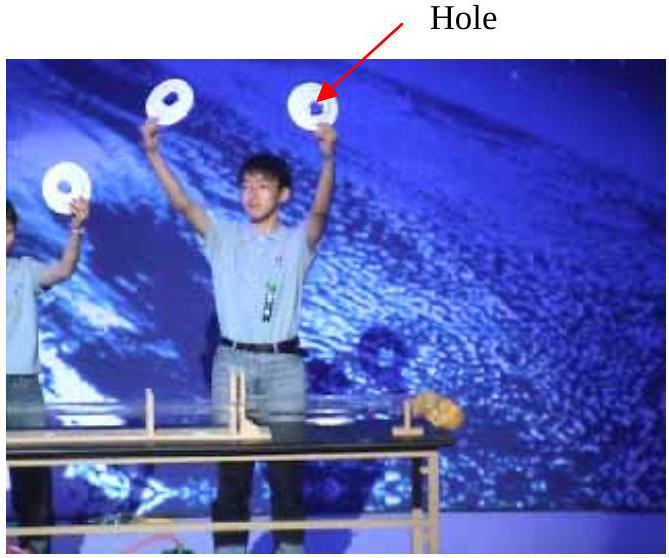
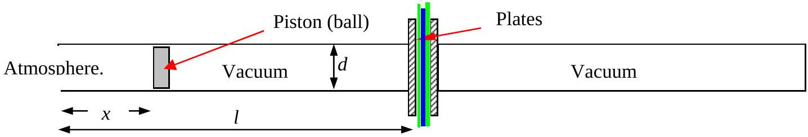

Q2

Figure 2.2

In the 2004 International Physics Olympiad in Korea a demonstration showed how a ping pong ball (table tennis ball) could make a hole in three ceramic plates, Figures 2.1 and 2.2. The ceramic plates were placed between two glass tubes. The tubes were then evacuated so that there was a vacuum on each side of the plates. Suddenly the tube was opened on the side of a ball adjacent to the end of the tube, Figure 2.1. The atmospheric pressure on that side shot the ball into the plates making a hole in the plates. The ball made a virtually air tight fit with the glass tubes with little friction.

a) i) Write down the maximum speed with which the ball could hit the plates.
    ii) The ball had a mass of 0.010 kg . Calculate its maximum KE.
b) Consider a cubic box, side $l$, volume $V$, containing $n$ molecules of mass $m$ all moving in random directions at constant speed $v$. All collisions are to be assumed to be perfectly elastic and the total volume of the molecules is very much less than $V$.
    (i) What is the change in momentum when a molecule, moving in an arbitrary direction, hits a face of the box with speed $u$ normal to the face of the box?
    (ii) Calculate the average time it takes this molecule to traverse the box.
    (iii) Hence, or otherwise, show that the pressure in the box, $p$, is related to $v, m, n$, and $V$ by
$$
p=\frac{1}{3 V} n m v^{2},
$$
when the molecules are moving in random directions with speed $v$.
c) 

Figure 2.3 shows a simplified diagram of the experiment where the ping pong ball, diameter $d$, has been replaced by a gas tight piston of mass $M$ diameter $d$. The distance from the end of the tube, length $l$ is $x$ and its speed is $u_{x}$ at time $t$.
(i) Assuming that $v$, the speed of the molecules, remains the same, derive a formula that relates the pressure on the piston to $n, m, v, l$ and $d$ when the piston is moving at speed $u_{x}$.
(ii) Find an expression for the acceleration of the piston when it is at a distance $x$ from the end of the tube. Assume that $u_{x} \ll c_{s}$, where $c_{s}$ is the speed of sound of air at the local temperature.
