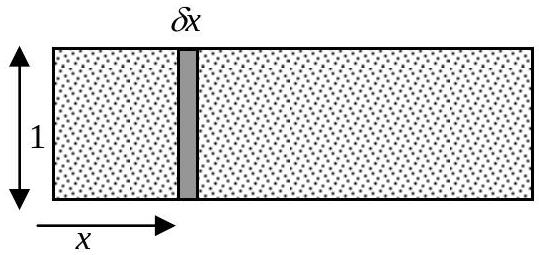
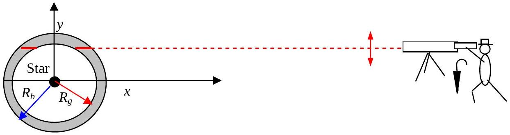
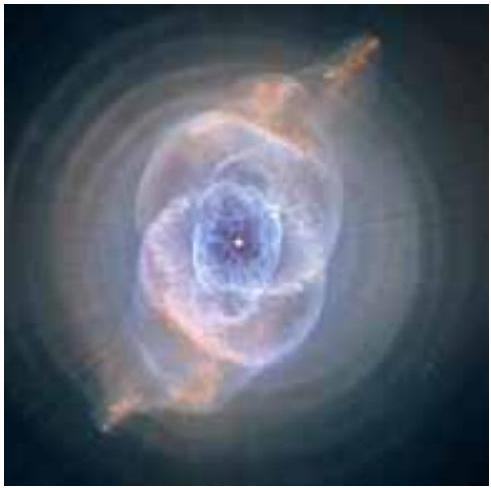

Q4

Figure 4.1

a) Figure 4.1 shows a glowing gas in a rectangular glass box. The square cross section, perpendicular to the plane of the diagram, of the ends of the box is $1 \mathrm{~m}^{2}$. The intensity of the light emitted in the $x$ direction due to the glowing atoms in a volume (Figure 4.1) of thickness $\delta x$ is $k \delta x$, where $k$ is a constant. The absorption of the light due to this same volume is $\sigma I_{x} \delta x$, where $\sigma$ is a constant and $I_{x}$ is the incident intensity, in the direction of increasing $x$, normally on the element of thickness $\delta x$. Show that this leads to the differential equation

$$
\frac{d I_{x}}{d x}=-\sigma I_{x}+k .
$$

(i) Use this equation to find an explicit relation between $x$ and $I_{x}$. (Mathematical integrals are listed on page1. The units of intensity are $W m^{-2}$ ).
(ii) Find an expression for the intensity $I_{m}$ when $x$ is very large and an expression for $x$ in terms of $I_{0.5}$ where $I_{0.5}=0.5 I_{m}$.

b)

Figure 4.2

Figure 4.3

Figure 4.2 shows an observer looking at a luminous cloud around a central star, in the form of a spherical shell, between the radii $R_{b}$ and $R_{g}$. His distance from the star is very much greater than the radius of the cloud. The thickness of the cloud is much less than the radius of the cloud. In the position shown on the diagram the thickness of the cloud in the line of sight is the sum of the lengths of the two full red lines shown in Figure 4.2. The star forms the origin of a Cartesian coordinate system with the $x$-axis parallel to the line of sight and the y -axis at right angles to it.
(i) Find expression/expressions that give the total length of this path through the cloud in terms of $y$ and the other relevant parameters.
(ii) Hence find an expression that gives the variation of the intensity of the light, $I_{x}$, with $y$.
(iii) Sketch a graph of $I_{x}$ against $y$.
c)

Figure 4.3 shows a picture taken by the Hubble Telescope. A star is seen in the centre of the picture.

(i) Describe qualitatively the main features of Figure 4.3.
(ii) Suggest, with reference to part b , how these features may be explained.
