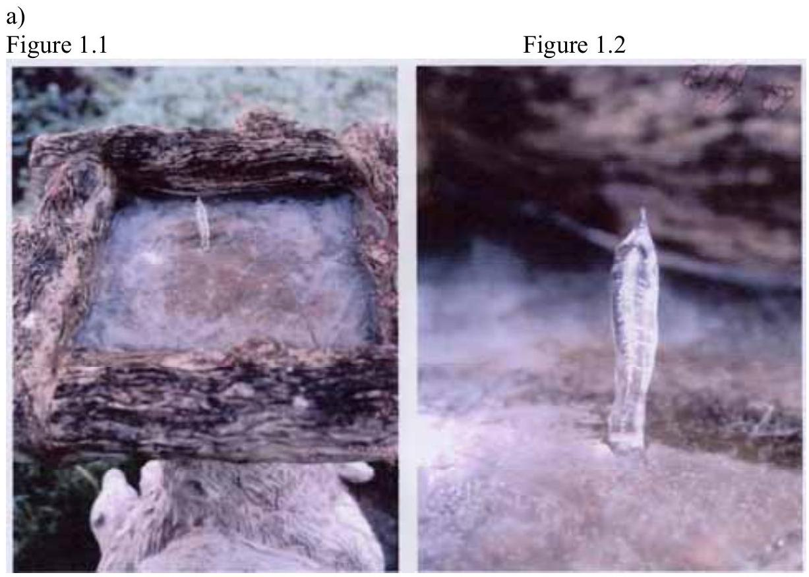
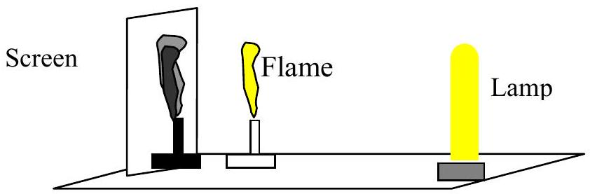

Q1 In this question you are asked to make reasoned estimates and assumptions. These must be clearly stated

Figure 1.1 shows a photograph of the ice in a birdbath made of stone. Figure 1.2 shows a detailed picture of the pillar of ice shown in Figure1.1. The birdbath was in the open air and no water fell from above. Suggest an explanation.

b) A recent item of the national news reported "Scientists say that magnetic bracelets fail to cure aches and pains ". Outline the difficulties in performing a double blind test to settle this question.

Figure 1.3 shows a demonstration of the dark shadow of a gas flame that has particles of salt in it. The lamp is a bright low pressure sodium lamp. Without the salt there is little shadow. Replacing the lamp with a tungsten filament lamp and a yellow filter destroys the black shadow. Explain.

d) On a clear day in summer the normal incident radiation on the surface of the Earth from the Sun is about $1000 \mathrm{Wm}^{-2}$. By making suitable simplifying assumptions, determine (i) the power per square metre of radiation emitted from the surface of the Sun and (ii) the pressure on the surface of the Sun due to this radiation. You may assume that the energy of a photon is $h f$, frequency $f$, and its momentum is $h f / c$. Calculate how many photons of wavelength 590 nm would be needed to accelerate a proton to a speed equivalent to a temperature of $10^{6} \mathrm{~K}$.
