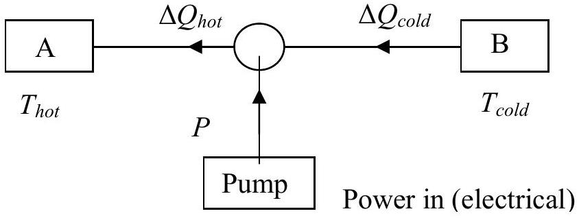

Q2
A heat pump is a device that pumps heat from a body at a temperature $T_{\text {cold }}$, to a body at a temperature $T_{\text {hot }}$. An example of a heat pump is a domestic refrigerator. The heat is pumped from the inside of the refrigerator to the outside. The pump will cool the inside of the refrigerator until a predetermined temperature is reached.

In some countries a heat pump is used as a domestic heater in winter and as an air conditioner in summer, i.e. cooling the air in the room and pumping the heat to the outside.

Figure 2.1

Figure 2.1 is a block diagram of the heat pump/refrigerator. A is the hot body at temperature $T_{\text {hot }}$. B is the cold body at temperature $T_{\text {cold }} . \Delta Q_{\text {hot }}$ and $\Delta Q_{\text {cold }}$ are the quantities of heat per second absorbed by A, and extracted from B. The pump delivers power $P$ to achieve this.
a) Write down an equation relating $\Delta Q_{\text {hot }}, \Delta Q_{\text {cold }}$ and $P$. In addition it can be shown that an ideal heat pump satisfies the equation:

$$
\frac{\Delta Q_{\text {hot }}}{\Delta Q_{\text {cold }}}=\frac{T_{\text {hot }}}{T_{\text {cold }}} .
$$

b) Find the heating power that can be delivered into a room by an ideal heat pump if the pump power, $P$, is 1.0 kW , when the outside temperature is 280 K and the temperature of the room is 293 K . Comment on your answer.
c ) In an experiment using 2.0 kW heat pump the cold body B is a tank with 10 kg of water initially at 290 K . Ignore the thermal capacity of the empty tank. The rate of heat leakage into the tank from its surroundings only is $20 \theta$ W, where $\theta$ is the temperature difference between the tank and its surroundings that are at a constant 290 K . Assume that $T_{\text {hot }}$ is constant at 305 K . Write down an equation for the rate of fall of temperature of the tank. Calculate the quantity of heat reaching the hot body per second:

(i) initially, when the tank is 290 K
(ii) when the tank has reached 280 K .

Calculate rate of fall of temperature of the tank:

(iii) initially
(iv) at 280 K .
