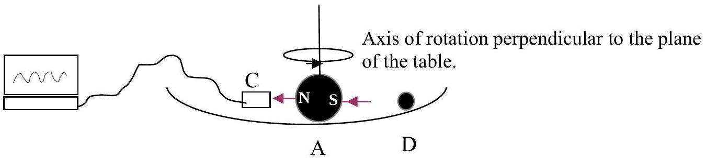
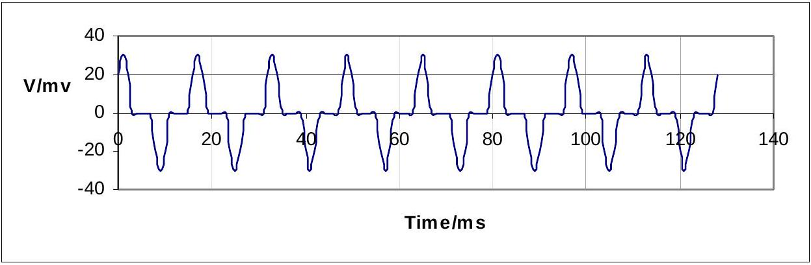

Q3

Figure 3.1

Figure 3.1 shows an experiment involving a rotational collision between two steel ball bearings, A and D. They rest in a very shallow spherical dish on a horizontal table. A has diameter of 5 mm and is permanently magnetised, but not strongly. D has a diameter of 2 mm and is not permanently magnetised. The probe C can be either a Hall effect probe with output p.d. $V_{\text {out }}$ proportional to the magnetic field $\boldsymbol{B}$, or a small search coil. $V_{\text {out }}$ has the form shown in Figure 3.2 . A line joining the North and South poles is parallel to the plane on which the dish is resting.

Figure 3.2

a) Use the data displayed in Figure 3.2 to calculate the angular velocity of the ball A .
b) Reproduce Figure 3.2 for a single period beginning at Time = 0 and superpose a sketch of the output expected from a search coil
c) Initially the ball bearing A is given an angular velocity about a vertical axis when D is not present. After a short period of time ball D is placed in the dish and allowed to roll slowly towards A. Ignore the rotation of D about a horizontal axis. A collision takes place and D, which is not permanently magnetised, bounces away. Using the hint and the Table below, or otherwise, sketch, with numerical values, the trace observed on the computer, using the Hall probe, before and after the collision. Assume that no slippage occurs between the contact surfaces when the balls collide.

| Linear motion | Rotational motion | Sphere |
| :--- | :--- | :--- |
| Mass $m$ | Moment of inertia $I$ | $I=0.4 m r^{2}, r$ is the radius |
| Linear Momentum $m v$ | Angular Momentum $I \omega$ |  |
| $v$ is the linear velocity | $\omega$ is the angular velocity |  |

Hint: You may assume that the laws for angular motion are similar to those for linear motion. This results in similar equations of motion.
