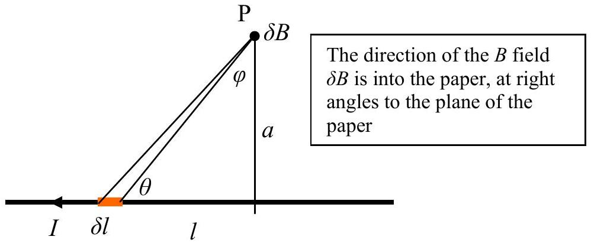
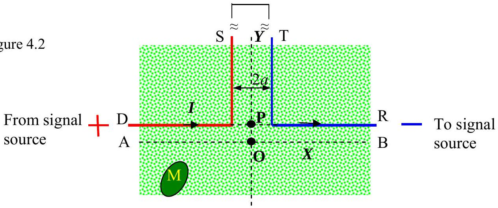

Q4

Figure 4.1

a) The Biot Savart law relates the magnetic field $\delta B$ at P to the current $I$ in an element of wire length $\delta l$ Figure 4.1.

$$
\delta B=\left(\frac{\mu_{0}}{4 \pi}\right) \frac{I \operatorname{Sin} \theta \delta l}{r^{2}}
$$

where $\mu_{0}$ is the permeability of free space.

b) Show that for an infinitely long wire this becomes
$$
B=\left(\frac{\mu_{0}}{4 \pi}\right) \frac{2 I}{a} .
$$
c) 
Figure 2 shows the plan view of part of a grass lawn. The mower M is controlled by the magnetic field from the wires, DS and TR, as shown in Figure 4.2. Only a small part of the lawn is shown. The wires are connected in series. The parts of the wires that are not shown in Figure 4.2 are very long. The distance PO is $a$. The blue and red wires are $2 a$ apart where they run parallel.
(i) Use the result in (b) or otherwise to find the value of the magnetic field, $B_{\mathrm{P}}$, at P.
(ii) Find an expression for the magnetic field for the magnetic field $B_{\mathrm{O}}$, at O.
(iii) Sketch the value of the magnetic field against distance along the $Y$ axis.

## THIS PAGE IS BLANK
