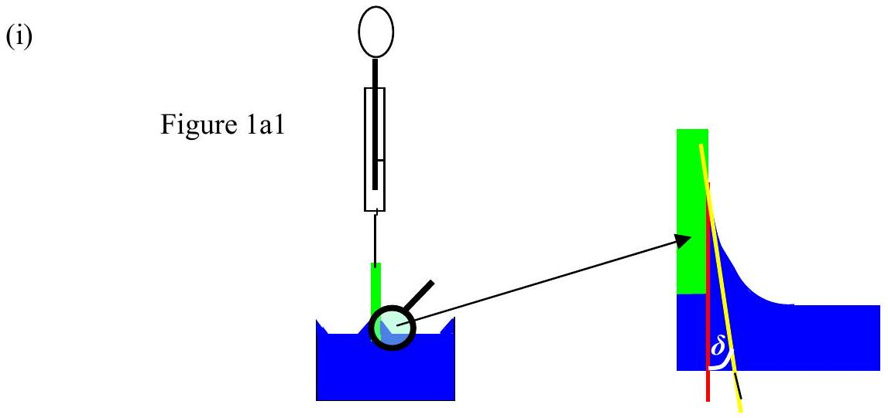
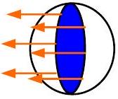
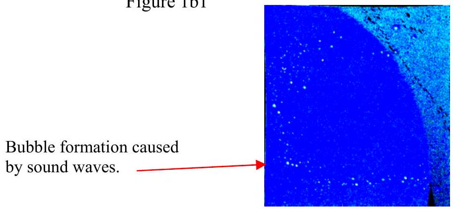
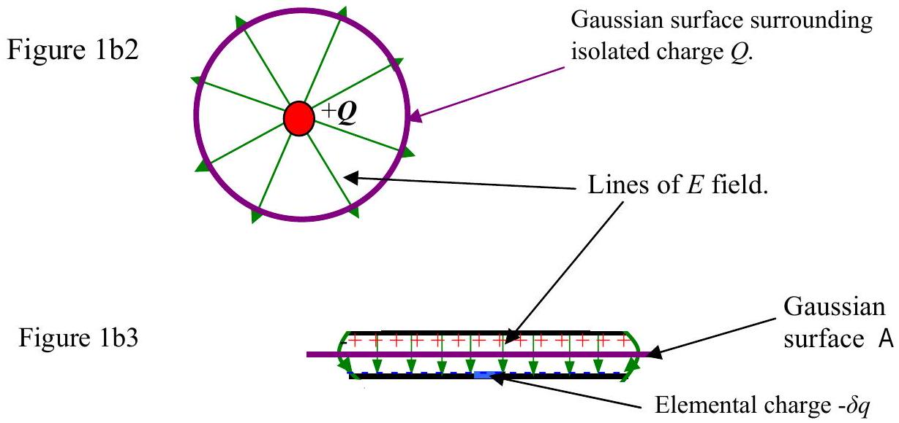
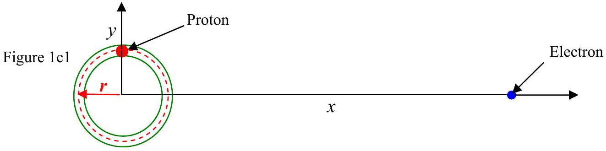

Q1
1a This question is about surface tension. You are unlikely to have studied it in depth, if at all; however sufficient help is given to enable you to solve the problems.

The surface tension $\tau$ is the force per unit length in the surface of a liquid when the liquid is in contact with a solid perpendicular to the line of contact of the surface with the solid. An example is given in Figure 1a1 where a clean glass microscope slide is hung on a balance and lowered into clean water such that the water just touches the base of the slide. The water wets the glass and the surface of the water adjusts so that it climbs and makes a very small angle ( $\delta$ ) with the surface of the glass. This angle is named the angle of contact and is practically zero for clean water and clean glass. There is tension between the molecules of water and it is that tension that pulls down the glass slide. The length of the slide "into the paper" is $l$ giving the total perimeter approximately $2 l$. Show that

$$
\tau=\frac{W_{s t}-W}{2 l \operatorname{Cos} \delta},
$$

where $W_{s t}$ is the weight of the slide after immersion and $W$ is the weight of the slide before immersion.

Figure1a2

Figure1a2 shows a small water droplet, radius $R$. The dark blue is the circular water surface if the droplet is cut in half. The perimeter of the blue circle is the line along which the tension acts, illustrated by the orange arrows. By considering the stability of one hemisphere, or otherwise, show that:

$$
p=\frac{2 \tau}{R} \quad \text { Equation 1a } 2
$$

where $p$ is the excess pressure in the droplet above the surroundings.

1b

The phenomenon of cavitation is caused by low pressure. This a very difficult problem affecting a ship's propellers, pumps etc. Parts of the liquid reach a lower pressure causing the liquid to superheat locally and cause bubbles to form. These grow and then may suffer catastrophic collapse. The temperature in a collapsing bubble may reach values greater than $10^{4} \mathrm{~K}$. Some have speculated that this might be used to initiate fusion. Sound waves may initiate the formation of bubbles and light may be emitted during their collapse, Figure 1b1. Equation 1a2 shows that the pressure in a very small bubble will be high so that a higher water temperature than normal boiling point may be needed to initiate the bubble formation. A charged bubble will reduce the temperature needed to start the bubble. This is used to show the tracks of charged particles through hydrogen liquid bubble chambers.

Figure 1b3 shows a cross section of two large metal plates with a charge of $+q$ and $-q$. The area of a plate is $A$. Ignoring edge effects show that the force of attraction between the plates is given by:

$$
F=\frac{q^{2}}{2 \varepsilon_{o} A} .
$$

(Hint. The theorem of Gauss states that if a surface $A$, is found such that the lines of electric field pierce that surface at right angles to the surface then for a simple symmetrical case,

$$
E A \varepsilon_{o}=q,
$$

where $E$ is the electric field, $\varepsilon_{o}$ is a constant, $q$ is the charge enclosed by the surface and $A$ is the surface area of the surface that surrounds the charge. Any surface that encloses a charge in this way is called a Gaussian surface. Figure 1b2 shows a spherical Gaussian surface around a small isolated charge $Q$. The purple line in Figure 1b3 shows the Gaussian surface enclosing the charge $q$. Consider the force on an elemental charge - $\delta q$ due to the $E$ field it is in.)

Hence or otherwise find the outward pressure on an isolated spherical water drop with a charge $q$, radius $r$. Find the outward pressure due to the electrostatic effect on a bubble in water with a radius of $20 \mu \mathrm{~m}$ whose charge is caused by $10^{9}$ excess electrons. How does this compare with normal atmospheric pressure?

A proton is constrained to move in a circle of radius $r$ at an angular velocity of $\omega$ in a non conducting ring, in the $x, y$ plane Figure 1c1. Note that $r \omega \ll c$ the velocity of light Consider an electron a large distance $x$ away from the centre of the ring, find an expression for the force on the stationary electron. Is the force the same if the electron moves? Explain your answer. Why will a charged particle moving in a circular track in a very good vacuum lose energy?
