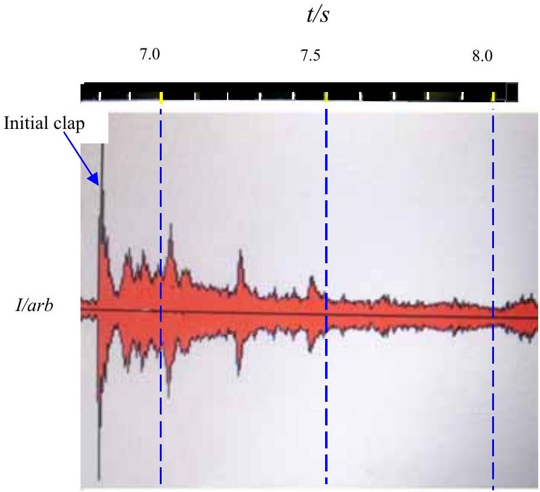
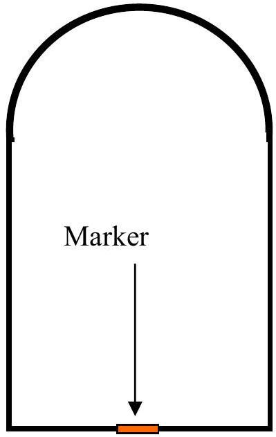

Q2

Figure 2.1a

Figure 2.1b

a) Figure 2.1b shows a simplified cross section of the Jamie mosque in Isfahan in Iran (venue of the International Olympiad in 2007). On the floor of the mosque there is a metal marker. If one claps one's hands near the marker it is suggested that multiple echoes should be heard. A digital camera was placed on the marker. Hands were clapped and the sounds recorded by a digital camera in "movie mode". Figure 2.1a shows a recording of the intensity of the sound. A time scale is shown in Figure 2.1a. There was a discussion amongst the physics leaders as to whether the marker is at the centre of the circular dome (if it is circular in cross section) or at the focus of the dome. N.B the sketch in Figure 2.1b is not to scale or correct proportion.
(i) Is the marker at the focus or the centre of curvature of the dome you can assume is spherical? How is it possible to decide this from the given data?
\{ii) Use the information given to determine the height of the centre of the interior of the dome. Carefully estimate the errors.
(iii) The intensity of sound, $I$, is given by

$$
I=I_{o} \operatorname{Sin}(\omega t),
$$

$\omega$ is the angular frequency, $I_{o}$ is the max intensity, a constant, and $t$ is the time.

It is suggested that the max intensity of the sound at the first reflection $\left(I_{1}\right)$ is related to that of the second reflection $\left(I_{2}\right)$ by an equation mathematically similar to that of radioactive decay measured at equal time intervals i.e.

$$
\frac{I_{o}}{I_{1}}=\frac{I_{1}}{I_{2}} .
$$

By analysing the diagram Figure 2.1a find evidence to support, or reject, this assertion. Explain why your conclusion should be expected on theoretical grounds.
