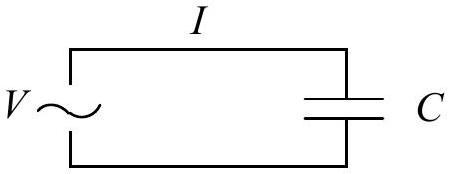
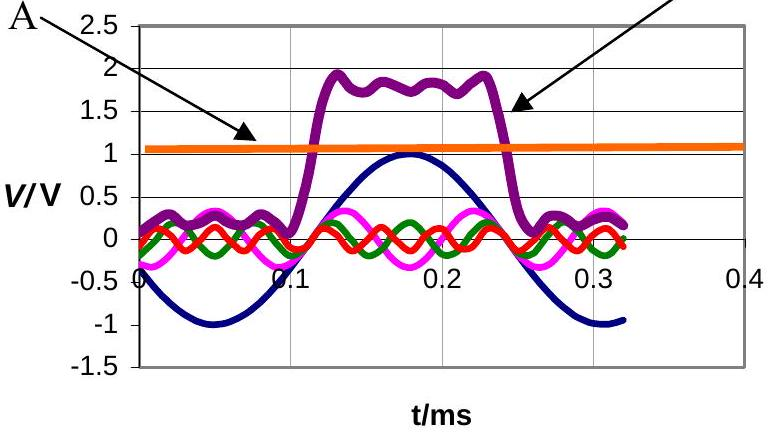
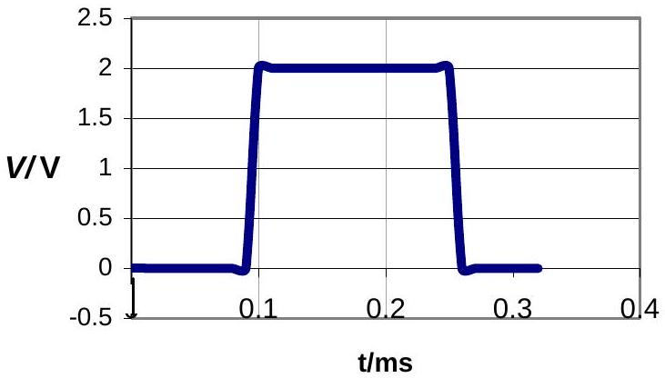
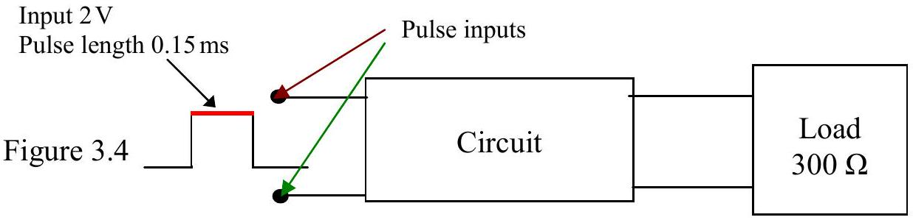

Q3

Figure 3.1

a) The charge on a capacitor, $Q$, of capacity, $C$, is related to its pd, $V$, by the formula $Q=C V$. In the circuit Figure 3.1 at time $t$

$$
V=V_{o} \sin \omega t,
$$

$V_{o}$ is the maximum value of $V$ and $\omega$ is the angular frequency of the applied ac. Show that the current in the wires is given by

$$
I=I_{o} \cos \omega t .
$$

Find an expression for $V_{o}$ in terms of $I_{o}$ and $\omega$.

b) The magnitude of the impedance of the capacitor is defined as $\frac{V_{o}}{I_{o}}$.

Figure 3.3

Figure 3.2

Figure 3.2 shows a periodic square pulse of 2 V with a period of 0.30 ms. This can be approximated by the addition of four sine waves and a dc of 1 V, see A in Figure 3.2. Line B, Figure 3.3, is the plot of

$$
V=1+\left(\operatorname{Sin} 2 \pi f_{o} t\right)-\frac{1}{3} \operatorname{Sin}\left(2 \pi 6 f_{o} t\right)+\frac{1}{5} \operatorname{Sin}\left(2 \pi 10 f_{o} t\right)-\frac{1}{5} \operatorname{Sin}\left(2 \pi 14 f_{o} t\right) .
$$

Where $f_{o}$ is the lowest frequency in Figure 3.3.
Suggest a circuit, to insert into Figure 3.4, giving suggested component value(s) such that the current in the load would be approximately a sine wave. The load has a resistance of $300 \Omega$.

