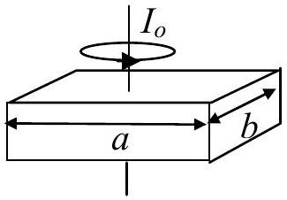
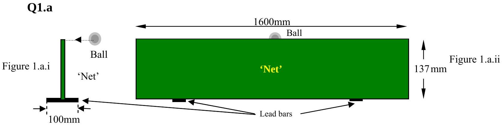
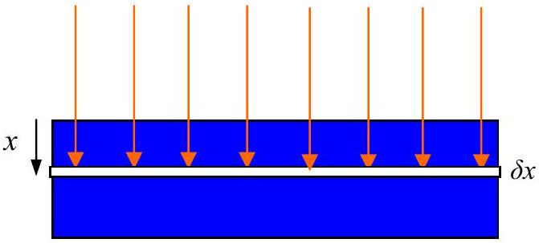
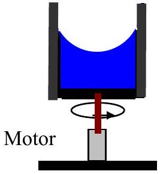
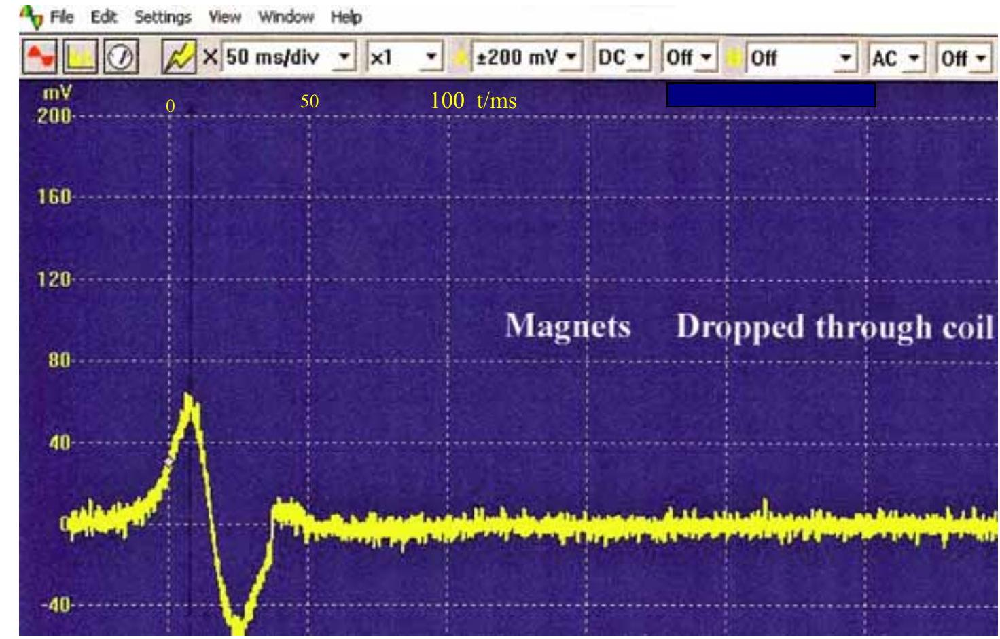
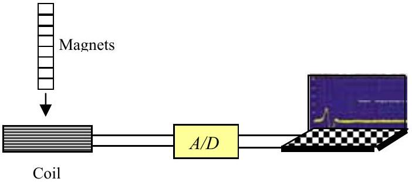
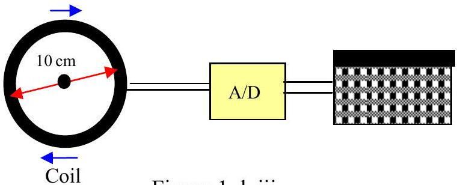
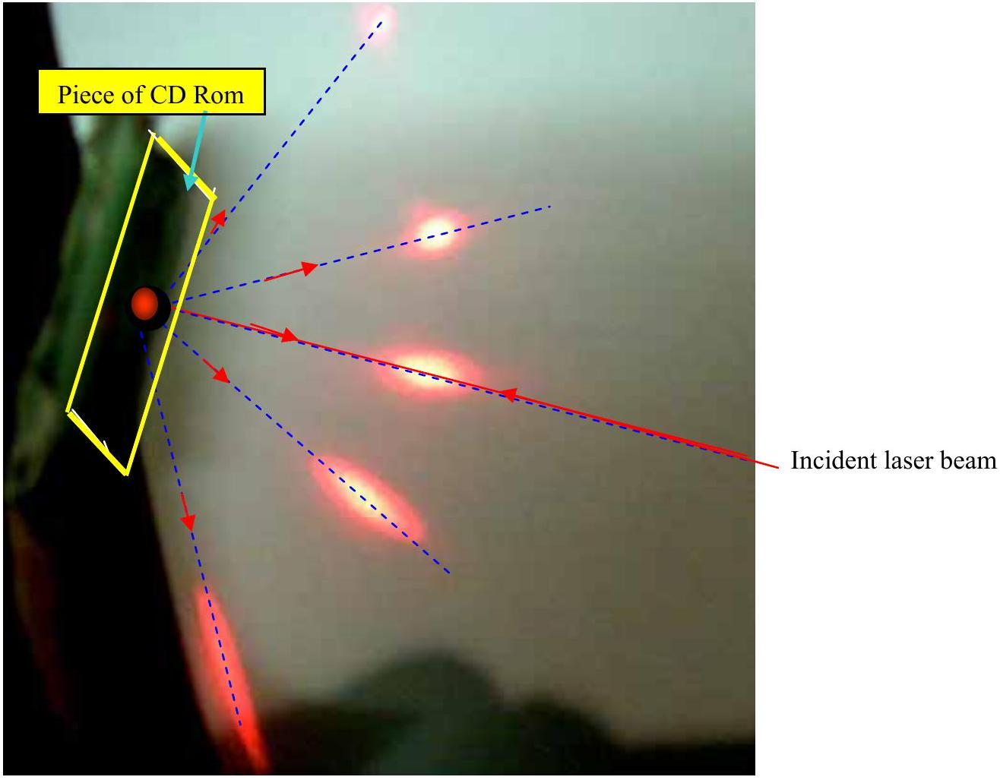

## BRITISH PHYSICS OLYMPIAD

2010 Paper 3
Monday $1^{\text {st }}$ March 2010

Time allowed 3hrs plus 15 minutes reading time. All questions should be attempted.
Questions 1 and 2 both carry 50 marks.
This is a challenging paper. Do not be discouraged if you cannot attempt all sections.

| Speed of light in free space | $c$ | $3.00 \times 10^{8}$ | $\mathrm{m} \mathrm{s}^{-1}$ |
| :--- | :--- | :--- | :--- |
| Gravitational constant | $G$ | $6.67 \times 10^{-11}$ | $\mathrm{N} \mathrm{m}^{2} \mathrm{~kg}^{-2}$ |
| Acceleration of free fall at Earth's surface | $g$ | 9.81 | $\mathrm{m} \mathrm{s}^{-2}$ |
| Earth-Moon distance | $R_{\text {EM }}$ | $3.82 \times 10^{8}$ | m |
| Radius of the Earth | $R_{\mathrm{E}}$ | $6.37 \times 10^{6}$ | m |
| Mass of the Earth | $M_{\text {Earth }}$ | $5.97 \times 10^{24}$ | kg |
| Mass of the Sun | $M_{\text {Sun }}$ | $1.99 \times 10^{30}$ | kg |
| Radius of the Sun | $R_{\text {Sun }}$ | $6.96 \times 10^{8}$ | m |
| Density of lead | $\rho_{p b}$ | $11.0 \times 10^{3}$ | $\mathrm{kgm}^{-3}$ |
| Density of wood | $\rho_{w d}$ | $0.60 \times 10^{3}$ | $\mathrm{kgm}^{-3}$ |
| Radius of the Earth's orbit around the Sun | $R_{\text {ES }}$ | $1.50 \times 10^{11}$ | m |
| Permeability of free space | $\mu_{\mathrm{o}}$ | $4 \pi \times 10^{-7}$ | $\mathrm{Hm}^{-1}$ |
| Permittivity of free space | $\varepsilon_{0}$ | $8.85 \times 10^{-12}$ | $\mathrm{Fm}^{-1}$ |

Formula : Moment of inertia of a rectangular body mass $M$ about its centre of mass:

$$
I_{0}=M\left(\frac{a^{2}+b^{2}}{12}\right)
$$

Parallel axis theorem: For a body mass $M: I_{d}=I_{0}+M d^{2} . I_{o}$ is the Moment of Inertia of the body about its centre of mass. $I_{d}$ is the M of I of the mass about a parallel axis a distance $d$ from the axis through the centre of mass.

For an EM wave in a vacuum: $\frac{1}{\sqrt{\varepsilon_{o} \mu_{o}}}=c$.

Figure 1.a.i shows the side on view and Figure.2.a.ii. the end on view of a new type of table tennis net. It consists of a thin piece of wood supported by two lead bars 100 mm long. The thickness of the 'net' is 5.0 mm , the width of the bars is 50.0 mm and the thickness of the lead is 3.0 mm. Whilst playing, a ball strikes the top of the net horizontally with its centre in line with the top of the 'net'. Assume the ball is not revolving when it hits the 'net'. The mass of a table tennis ball is $2.7 \times 10^{-3} \mathrm{~kg}$. The ball bounces back with $20 \%$ of its incident speed. Calculate the fastest speed it can hit the 'net' without the 'net' toppling over. Assume the 'net' and the bars do not slide on the surface of the table.

Q1.b

The Sun shines vertically down on to static seawater, Figure 1.b. The fraction of the power, $P$, absorbed by a thin layer of water thickness $\delta x$ at depth $x$, per square metre of surface is $\sigma P \delta x$. Write down an equation that connects the above variables. The thermal conductivity of water, $\kappa$, relates the rate of heat flow due to a temperature gradient. Write down an equation for this relation. Obtain a differential equation that relates the temperature of the water $\theta$ with the depth of the water $x$. Assume there are no convection currents. What is the condition for convection currents to start?

Q1.c

Figure 1.c.

Figure 1.c. shows a rotating glass cylinder containing a viscous liquid, density $\rho$. The electric motor rotates the cylinder at an angular velocity of $\omega$. Show that the liquid forms a parabolic surface and find the equation of the parabola. Some astronomical telescopes use rotating dishes filled with mercury to produce a reflecting parabolic surface. Show that a parabolic mirror does produce a focus and derive an expression relating the angular velocity of rotation to the focal length of the mirror. What type of advantages and disadvantages does this type of mirror have?

## Q 1.d

Figure 1.d.i.

Figure. 1.d.ii.

Figure 1.d. iii.

A tube of disc magnets was dropped through a coil. The computer recorded the EMF generated in the coil Figure 1.d.i. The coil is wound in a clockwise direction looking down, Figure 1.d.ii. and Figure 1.d.iii. The actual display is shown enlarged in Figure1.d.i. What quantitative and qualitative information can you obtain from the display? The physical length of the tube of magnets was 8.0 cm. The coil had 100 turns and an average diameter of 10 cm and was 1 cm thick.

Q 1e

Figure.1.e.

Figure.1.e shows a photo of a laser beam incident at $90^{\circ}$ on a piece of CD Rom. The laser has a wavelength of 620 nm. The dotted blue lines indicated the directions of the reflected laser light that strikes the paper at the red oblongs shown in the photo. Find the effective reflection grating spacing and hence estimate the maximum number of bits ( 1 or 0 ) that might be stored on the CD Rom.
(You can take measurements from the photo).
Q.1.f. Show that the energy stored in a capacitor $C$ storing a charge of $Q$ is $\frac{1}{2} \frac{Q^{2}}{C}=\frac{1}{2} C V^{2}$ where $V$ is the potential difference between the plates of the capacitor.
Show that the energy stored in a coil is given by $\frac{1}{2} L I^{2}$ where $I$ is the current in the coil and $L$ is the inductance of the coil. Find the energy stored in the electromagnet of the CMS detector of the Large Hadron Collider. The inductance of the large magnet is $L=14 \mathrm{H}$, the normal current is 19.5 kA, giving a magnetic field intensity at this current of 4.0 T. Calculate the energy stored and the average power output if the circuit was broken and the current reduced to zero in 2 ms.
