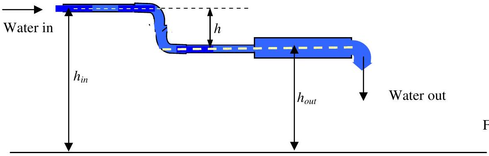
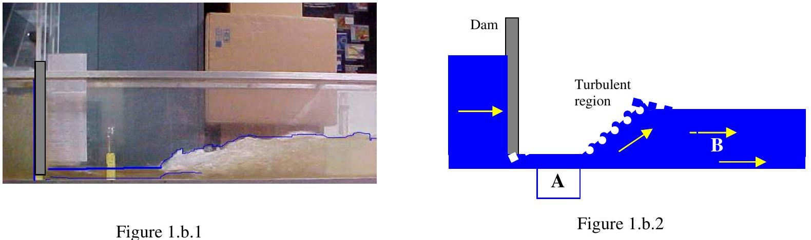
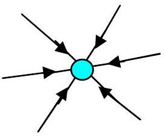

Q1

Figure 1.a
(a) Figure 1.a shows a schematic drawing of part of a water system. The cross sectional area of the in pipe is $a_{\mathrm{i}}$ and the cross sectional area of the out pipe is $a_{\mathrm{o}}$. What characteristics distinguish this system from similar pipes that contain a gas rather than water? Bernoulli's equation gives:
$$
p+\frac{1}{2} \rho v^{2}+\rho g h=\text { constant } \quad p, \text { pressure } \rho, \text { density }
$$
Write down an equation that relates $p_{\text {in }}, v_{\text {in }}, h_{\text {in }}$ to $p_{\text {out }}, v_{\text {out }}, h_{\text {out }}$, What does Bernoulli's equation assume?
(b)
Figure 1.b. 1 and Figure 1.b. 2 show the action of water flowing under an obstacle (dam).

Figure 1.b. 1 shows a photograph of a hydraulic jump with a turbulent region where the water rises and Figure 1.b. 2 is a diagram that shows the principal features of a hydraulic jump. Assuming that the width of the channel is constant, write down equations that predict the flow speed immediately before (region A) and after the turbulent region (region B).
(c) Describe in detail the energy changes that occur to the water in the channel.
Part (d) follows on page 3

(d) Read the following passage and answer the questions at the end.
D-D fuel cycle N.B. D is the same as ${ }^{2} \mathrm{H}$
Though more difficult to facilitate than the deuterium-tritium reaction, fusion can also be achieved through the reaction of deuterium with itself. This reaction has two branches that occur with nearly equal probability:
$$
\begin{array}{cl}
{ }^{2} \mathrm{H}+{ }^{2} \mathrm{H} \rightarrow{ }^{3} \mathrm{H}+\mathrm{p}+4.0 \mathrm{MeV} & \text { (p is a proton) } \\
{ }^{2} \mathrm{H}+{ }^{2} \mathrm{H} \rightarrow{ }^{3} \mathrm{He}+\mathrm{n}+3.3 \mathrm{MeV} & \text { (n is a neutron) }
\end{array}
$$
The optimum temperature for this reaction is 15 keV , only slightly higher than the optimum for the D-T reaction. The first branch does not produce neutrons, but it does produce tritium $\left({ }^{3} \mathrm{H}\right)$, so that a D-D reactor will not be completely tritium free, even though it does not require an input of tritium $\left({ }^{3} \mathrm{H}\right)$ or lithium.
$$
{ }^{3} \mathrm{H}+{ }^{2} \mathrm{H} \rightarrow{ }^{4} \mathrm{He}+\mathrm{n}+18.3 \mathrm{MeV}
$$
Most of the tritium produced will be burned before leaving the reactor, which reduces the tritium handling required, but also means that more neutrons are produced and that some of these are very energetic. The neutron from the second branch has an energy of only 2.45 MeV (0.393 pJ), whereas the neutron from the D-T reaction has an energy of $14.1 \mathrm{MeV}(2.26 \mathrm{pJ})$, resulting in a wider range of isotope production and material damage.
The primary advantage of the D-D fuel cycle is that tritium breeding is not required. Other advantages are independence from limitations of lithium resources and a somewhat softer neutron spectrum. The price to pay compared to D-T is that the energy confinement (at a given pressure) must be 30 times better and the power produced (at a given pressure and volume) is 68 times less.
Questions
(i) Explain what is meant by "The optimum temperature for this reaction is 15 keV".
(ii) What is this temperature in Kelvin?
(iii) Paraffin wax is good at stopping neutrons. Why?
(iv) Explain why the neutron from the D-T reaction has an energy of 14.1 MeV.
(v) Why is tritium difficult to handle?
(vi) What does "a somewhat softer neutron spectra" mean?

One way of bringing the deuterium to the point of criticality is to compress a small spherical capsule of it using multiple laser beams. Derive an expression for the momentum of light quanta of frequency $f$. Find the pressure produced on a 1mm diameter sphere using a laser of power 1MW with multiple beams that are spread around the sphere giving a uniform symmetrical pressure, see Figure 1.d.a.

