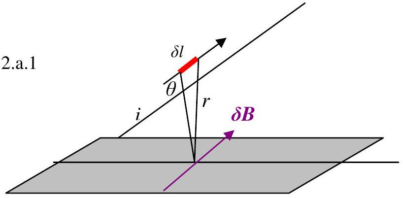
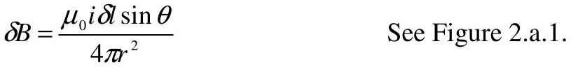
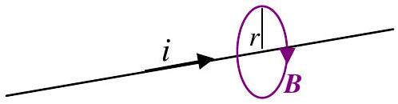
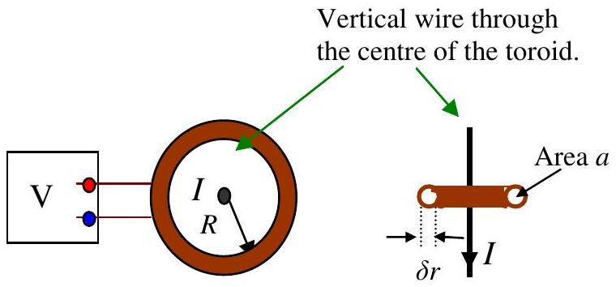
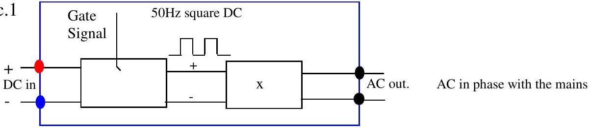
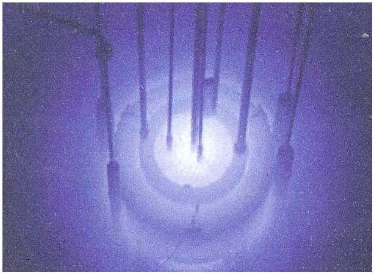
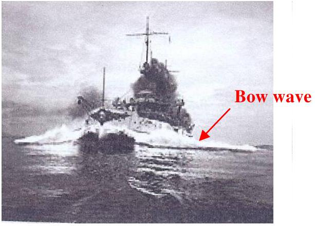
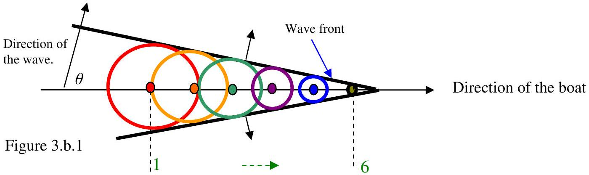

Q2

The law of Biot-Savart states that if a current $i$ is flowing in a wire at an angle $\theta$ to a plane then the magnetic flux density $\delta B$,as shown, is given by:

Hence show that a current $i$ flowing through a single straight very long wire will cause a field of $B=\frac{\mu_{0} i}{2 \pi r}$ as shown in Figure 2.a.2.

Figure 2.a. 2
(b) Figure 2.b. 1

A copper wire carrying a current of $I$ is shown in Figure 2.b.1. A toroidal coil, radius $R$, wound with copper wire carries a current $I$. The toroid has $N$ turns of wire and the cross sectional area of the ring is $a$, diameter $\delta r$. If the current in the vertical wire changes at a rate of $\frac{d I}{d t}$, what will the voltmeter read? (Assume $\delta r$ $\ll R$ ).
(c) A device called an inverter can be use to change DC into AC. A "tied" inverter connects a DC supply to the 240V 50Hz mains so that the p.d. produced by the inverter is sinusoidal and in phase with the mains. An example of the use of an inverter is to enable a photovoltaic panel to supply power to the grid. A block diagram of the type of circuit that could be used in an inverter is illustrated in Figure 2.c.1.

The steady DC is interrupted by the gate signal that produces an interrupted DC signal in phase with the mains. Suggest components that should be inserted in the box (x) to make the output sinusoidal and justify this choice by numerical calculations if appropriate.

Photograph 3.1

Photograph.3.2

(a) An electron is accelerated in an evacuated chamber. Sketch lines that illustrate how the magnetic field produced by the electron will vary with time.
(b) It is possible that charged particles can go through a medium such as water or glass faster than the speed of light in that medium. Consider a boat travelling along on the surface of the water, the disturbance (the bow wave Photograph 3.2) will spread in a way similar to the wave produced by series of circles caused by small stones dropped in the water in succession, 1 to 6, equally spaced in time and distance. This is shown in Figure 3.b.1.

Find the value of the angle, $\theta$, that the bow waves make with direction of the boat given that the speed of the boat is $5 \mathrm{~ms}^{-1}$ and the speed of the waves is $2 \mathrm{~ms}^{-1}$. The bow wave is illustrated in Photograph 3.2.

(c) Photograph 3.1 shows Cherenkov radiation, in the form of blue light, being produced by radioactive particles moving through water faster than the speed of light through water. Find a formula that relates the speed of the particles, $\nu_{p}$, to the refractive index of water, $\beta\left(\beta=\frac{\nu_{p}}{c}\right)$ and $\theta$. Theta $(\theta)$ is the angle that the emerging light makes with the incoming particle. Why is blue light observed?
(d) Use a very simple model to find how the Earth's temperature should vary with latitude. Comment how your model compares with what is observed.
