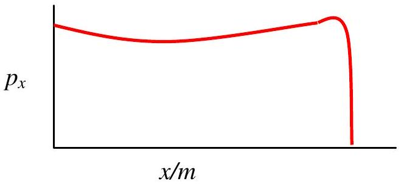
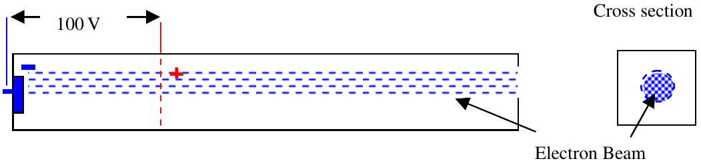
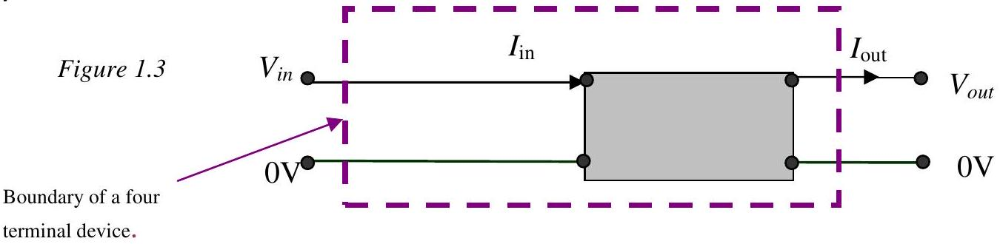

## BRITISH PHYSICS OLYMPIAD

British Physics Olympiad 2012

BPhO Round 2

Wednesday 1st February 2012

Time allowed 3hrs plus 15 minutes reading time. There are five questions. Graph paper and a scaled rule are needed for this examination. Attempt all questions. A standard formula sheet may be used.

| Mass of the Sun | $M_{\text {sun }}$ | $1.98 \times 10^{30}$ | kg |
| :--- | :--- | :--- | :--- |
| Earth-Moon distance | $R_{M E}$ | $3.84 \times 10^{8}$ | m |
| Earth-Sun distance | $R_{\text {ES }}$ | $1.50 \times 10^{11}$ | m |
| Venus Sun distance | $V_{v s}$ | $1.05 \times 10^{11}$ | m |
| Mean radius of the Earth | $R_{E}$ | $6.40 \times 10^{6}$ | m |
| Permeability of free space | $\mu_{o}$ | $4 \pi \times 10^{-7}$ | $\mathrm{H} \mathrm{m}^{-1}$ |
| Density of Gold | $d_{\mathrm{au}}$ | $1.93 \times 10^{4}$ | $\mathrm{kg} \mathrm{m}^{-3}$ |
| Molar mass of Gold | $M_{a u}$ | 19.6 | $\mathrm{g} \mathrm{mol}^{-1}$ |
| Resistivity of Gold | $\rho_{\text {au }}$ | $2.44 \times 10^{-8}$ | $\Omega \mathrm{m}$ |
| Avogadro number | $N_{A}$ | $6.02 \times 10^{23}$ | $\mathrm{mol}^{-1}$ |
| Hubble Constant | H | $74 \pm 3$ | $\mathrm{km} \mathrm{s}^{-1} \mathrm{Mpc}^{-1}$ |
| Parsec | pc | $3 \times 10^{16}$ | m |
| Charge on an electron | $e$ | $-1.6 \times 10^{-19}$ | C |
| Mass of an electron | $m_{e}$ | $9.1 \times 10^{-31}$ | kg |
| Mass of a proton | $m_{p}$ | $1.67 \times 10^{-27}$ | kg |
| Mass of a neutron | $m_{n}$ | $1.67 \times 10^{-27}$ | kg |
| Universal Gravitational Constant | $G$ | $6.67 \times 10^{-11}$ | $\mathrm{m}^{3} \mathrm{~kg}^{-1} \mathrm{~s}^{-2}$ |

In this question you are asked to make reasoned estimates, assumptions and explanations. These must be clearly stated.

(a)Figure 1.1

(i) The planet Venus orbits the Sun and is nearer the Sun than the Earth is. Viewed through weak binoculars Venus can often seem to be crescent shaped. Its size and shape appear to change some time later. Why is this?
(ii) The planet Venus does not appear to change in this way viewed by the naked eye. However, its brightness does vary throughout its orbit. How and why?
(iii) It was realised in the $18{ }^{\text {th }}$ century that if two telescopes on different parts of the Earth measured the position of Venus at the same time, the distance of the Earth to Venus could be determined and hence the scale of the Solar System. The radius of the Earth was quite well known. With the backing of the Royal Society, Captain Cooke performed the experiment when an eclipse of the Sun by Venus occurred (appearing as a black dot crossing the surface of the Sun). Why did he need the eclipse of the Sun? Why did he go to the South Pacific? Explain.
(iv) A long hose is connected to a tap. If the end of the hose is partially covered by a thumb, the water seems to squirt out much faster. Explain.
(v) Alpha radiation is observed and photographed digitally in a cloud chamber. The density of the track, ('light' pixels/per unit length $p_{x}$ ), is plotted against distance from the source $(x)$. Explain the shape of the graph in Figure 1.1.
(b) 

A beam of electrons is accelerated through a p.d. of 100 V in a high vacuum tube, Figure 1.2. There is no external magnetic field. The beam current is $1 \mu \mathrm{~A}$. The diameter of the cross section of the circular beam is 0.5 mm. Assume the electrons are constant density per unit area across the beam. Calculate:

(i) The maximum velocity of the electrons.
(ii) The velocity of electrons after they have travelled half the distance in the accelerating field.
(iii) The magnetic field a distance of 5 mm from the centre of the beam.
(iv) What happens if the accelerating p.d. is increased to 100 kV?

(c) 
(i) Figure1.3 shows an active four terminal device (it has internal power supplies). $I_{\text {in }}$ is very small and the output behaves as if it is of p.d. $V_{\text {out }}$ and internal resistance $r$, where $r$ is a constant. Draw a very simple circuit that will behave in this way.
(ii) Show that if the resistance $r$ is large compared to the resistance of the subsequent resistors in a complete circuit then the current $I_{\text {out }}$ will be constant and the device will act as a constant current source. What is the condition for a constant voltage source? Suggest a circuit for a constant voltage source.
