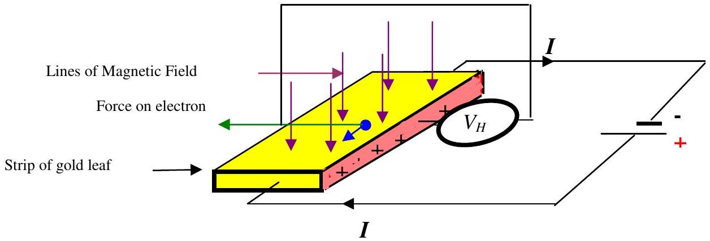

Q5
In the late $19{ }^{\text {th }}$ century the American student, Edwin Hall, was given the problem of observing the effect of a magnetic field on electrons travelling in a conductor. This is known as the Hall effect and the probe has been used in Q4.

Figure 5.1

Figure 5.1. Illustrates the experiment. A current is passed through a strip of gold leaf and the current carriers (usually electrons) pass through the gold leaf. The current passes through the gold leaf in the direction shown. The magnetic field acts on the moving current carriers and these carriers are pulled to the left. One thin edge of the gold leaf becomes positive (coloured pink/grey), relative to the other side. The Hall voltage, $V_{H}$ is the p.d. between points on the pink/grey face and the side opposite.

(i) The number density of the carriers is $n$, the cross sectional area of the strip is $a$, the charge on the current carrier (electrons) is $e$. Derive or write down an expression for the drift velocity, $v_{d}$ in terms of $I, n, a, e$.
(ii) Draw a circuit diagram that shows a practical circuit that could measure the Hall effect in a strip of gold leaf. The effect is very small.
(iii) The charge carriers in semiconductors are fewer - therefore they move more rapidly for the same current density. How does this make the sensors based on Hall voltage more sensitive? In some materials the polarity of the voltage is reversed. Comment.
(iv) Measuring the thickness of the gold leaf is difficult. A student knows that when viewing a strong white light through a piece of gold leaf the light appears green - blue. He has also read that if 1 g of gold is beaten out as thin as possible it covers an area of $50 \mathrm{~m}^{2}$. Are these facts consistent? Explain.
(v) The highest field available is 0.1 T. The length of the gold leaf is 40 mm , the width 10 mm and the current is 200 mA . What is the drift velocity of the free electrons (one per atom)? What would be the Hall voltage?

## END OF PAPER.

Please attach the BPhO Round 2 cover sheet to the answer sheets and return to the following address by $\boldsymbol{6}^{\text {th }}$ February 2012:
A.G.Bagnall,
2 St Peter's Barn
West Knighton
Dorchester
Dorset
DT2 8PF

Note:
Please email bagnall@stpeters5.demon.co.uk giving details of date time etc of despatch.
Please use Normal $1{ }^{\text {st }}$ Class post and retain a photocopy of the script.
