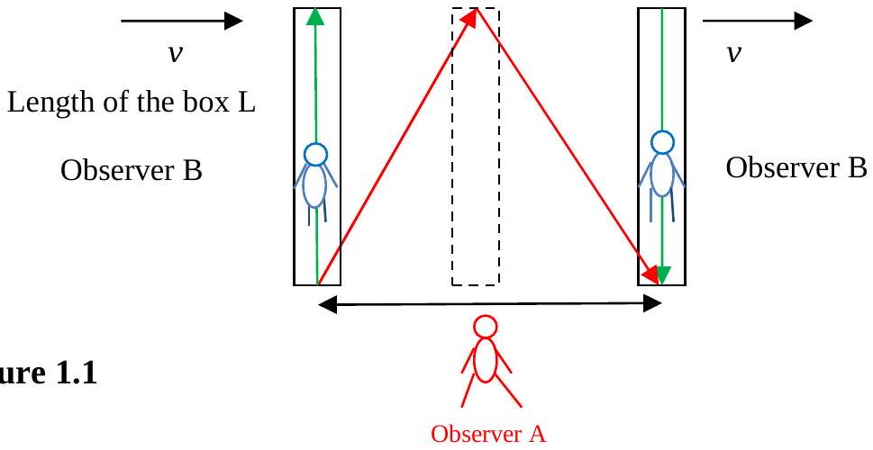
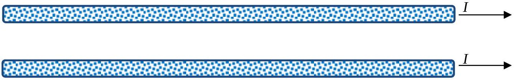

1. Observations show that the speed of light in a vacuum is always the same whatever the speed of the source relative to that of the observer.

a) Light, illustrated by green arrows, bounces up and down in the box that has perfect mirrors at each end. Observer B is in the box and Observer A is outside the box. The box is observed by A to be moving past at a speed of $v$.
    (i) How far does Observer B think the light has travelled?
    (ii) How far does Observer A think the light has travelled?
    (iii) How long does Observer B think the light takes to travel this distance?
    (iv) How long does Observer A think the light takes to travel this distance?
b) Two copper wires carry a current of $I$ amps, Figure 1.2. The wires are 1mm in diameter and you may assume that there is one free electron per atom.

Figure 1.2
Find the speed at which the electrons drift down the wire (ignore thermal effects). Use a semi-quantitative argument to show that there will be a force between the wires when a current $I$ flows in each wire - without bringing in the concept of magnetism.
