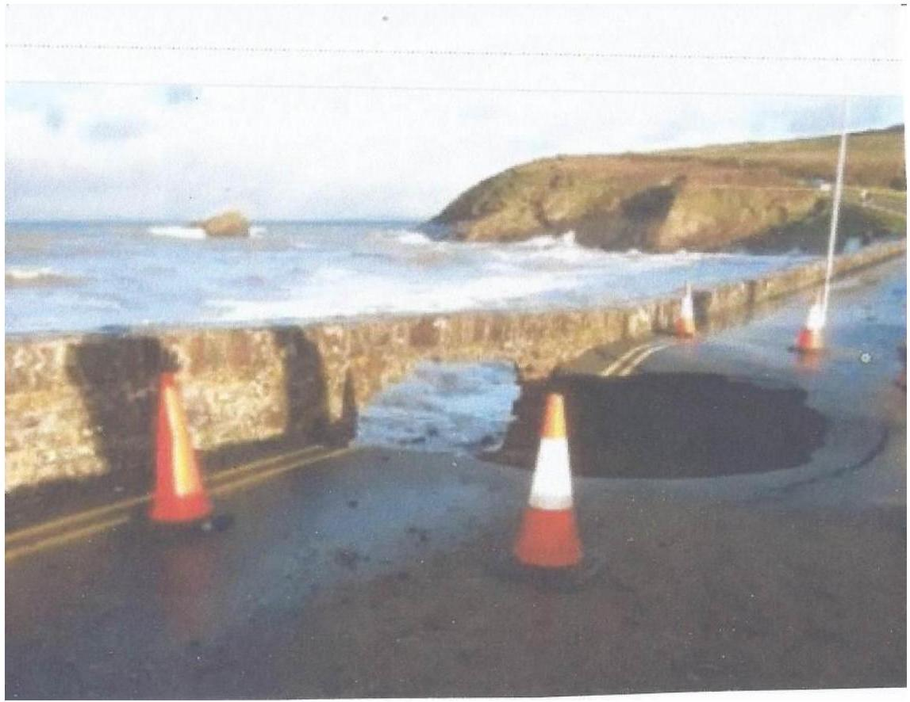
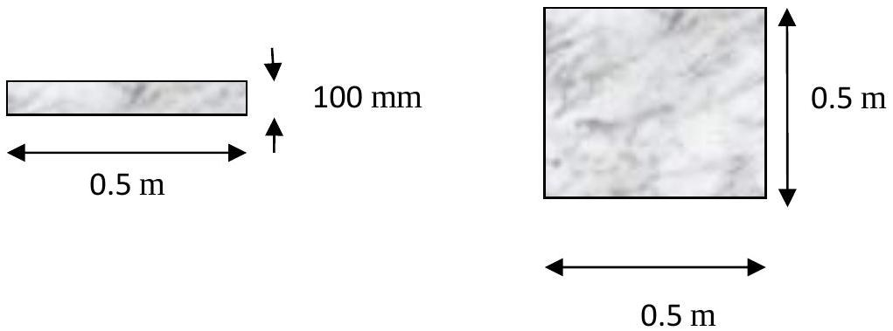

2. 
Figure 2.1

The photo, Figure 2.1, was taken at Broadhaven, Pembrokeshire. The road that is damaged crossed a small stream flowing into the sea. The tidal range is about 8 m . The previous day at another location a wave hitting a harbour wall was observed to be producing a splash that rose 6 m high.

    (i) Calculate the speed at which the water was moving vertically upwards when it was about 3.5 m above the normal surface of the stream - that is about the level of the under surface of the bridge. Assume that an unrestricted splash would have been 6 m high.
    (ii) Find the force on a square stone in the under surface of the bridge that is 0.5 m × 0.5 m and with a thickness $\approx 100 \mathrm{~mm}$ as illustrated in Figure 2.2.

(iii) The density of the stone is $4000 \mathrm{~kg} \mathrm{~m}^{-3}$. What is the lowest speed of the water splash at which you might expect the bridge to fail?
