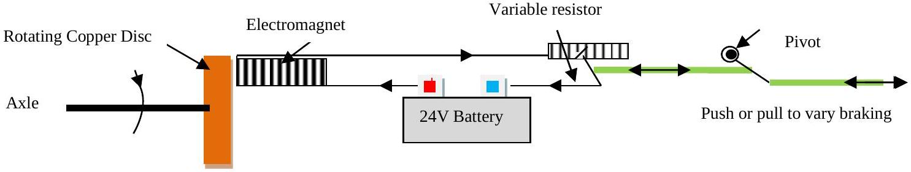

3. Most heavy vehicles are equipped with retarders that have a copper disc on a rotating axle. An electromagnet produces a magnetic field and this produces a force on the moving disc. .

Figure 3.1

The gradient of the road is 20\% (take this as the height lost/distance gone). The truck has a mass of 10 tonnes. The diameter of the copper disc is 0.5 m, the thickness of the disc 15 mm. Ignore other forms of braking such as engine braking, normal disc brakes, air resistance, etc.

    (i) Find an expression that would give the rate of heat generated in the copper disc.
    (ii) Find the initial rate of rise of temperature of the copper disc. The electromagnetic braking is designed to allow the lorry to descend a slope of 20\% at a steady $5 \mathrm{~ms}^{-1}$ without using engine braking or normal friction brakes.
    (iii) Estimate the final temperature of the disc assuming that the heat is lost only through radiation. Stefan's law states that the power radiated by a black body is $\mathrm{A} \sigma T^{4}$ where A is the area of the radiating body and $\sigma$ is the Stefan-Boltzmann constant. You may assume that the disc approximates to a black body in this case.
