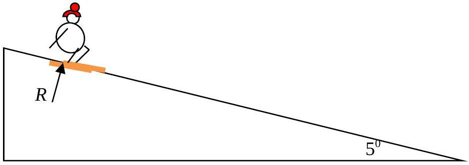
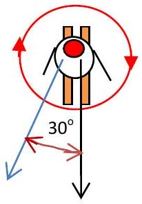
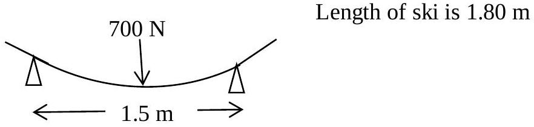

4.

Figure 4.1

Figure 4.2

a) Figure 4.1 shows a skier, mass 70 kg, going down a snow slope of $5^{0}$ that is covered in firm hard snow, temperature -4° C. His skis are initially parallel, close together and going down the line of steepest slope. He intends to go down the slope in a series of sweeping curves. His first turn is $30^{\circ}$ to the steepest slope and his next turn is through $60^{\circ}$. You are asked to answer the following questions as quantitatively as possible using estimated numerical values where appropriate. Ski jargon is not appropriate!
    (i) How can he reduce the normal reaction $R$ ? His mass is 70 kg. Give a numerical estimate of the maximum percentage of $R$ it would be reasonable to achieve.
    (ii) How can he rotate his skis in a clockwise direction? How can he stop the rotation?
b) Another way of turning (carving) depends on the skis bending to form a curve which enables the skier to follow a curved path. He decides to test the stiffness of the skis Figure 4.3. He uses a weight of 700 N.

Figure 4.3

(i) The skis are tested using the setup illustrated in Figure 4.3. A force of 700 N deflects the centre of the ski 50 mm. What speed should the skier be going to achieve a turn with a radius of curvature of 25 m? Comment.
(ii) Illustrate your solution with a force diagram. Is this the only consideration that concerns the skier? Ignore the presence of other skiers!
