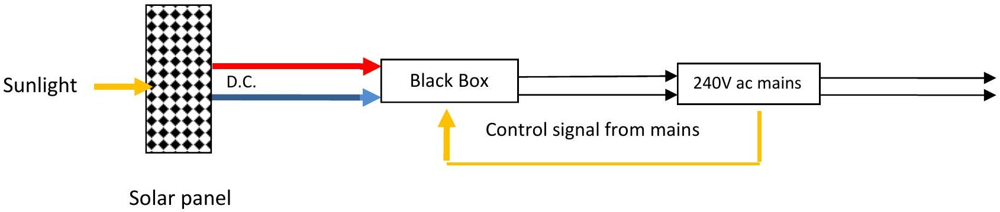

2. It can be shown that a square wave can be represented by a sum of sine waves as given by the formula below

$$
v=v_{0} \sin \omega_{0} t+v_{1} \sin \omega_{1} t+v_{2} \sin \omega_{2} t+v_{3} \sin \omega_{3} t+\ldots . .
$$

Solar cells have an output that is dc. The pd across a cell depends on the incident radiation and the efficiency of the solar cells - Hubble telescope cells have an efficiency of about 30\% in full sunlight. Solar cells for use on buildings etc. normally have an efficiency of about 15\%. The dc power from the solar cells has to be transmitted to the mains which is 240V ac. At your disposal you have electronic black boxes. A possible solution is sketched out in Figure 2.1 below.

Figure 2.1

What is the black box for? Suggest components for the black box.
Some electrical energy may be lost as heat. How can you maximise the efficiency of the electrical energy transfer from the solar panels to the 240 V ac of the mains?
Explain why electrical energy is transferred by the grid using three or four wires.
It has been suggested that one way of storing electrical energy would be to store it in a rotating flywheel. A simple flywheel should store electrical energy from a 1MW power supply for 20 minutes. Suggest a design for this flywheel. Marks are awarded for the detail of the design.
