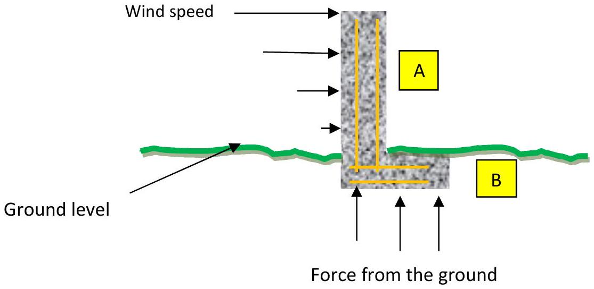

4. It has been reported that the wind speed reached $200 \mathrm{mph}\left(90 \mathrm{~ms}^{-1}\right)$ in the Philippines. This is capable of toppling walls.

Figure 4.1

A concrete wall is made from two sections A and B. Section A is 2 m high and section B is 1.3 m long. The thickness of the concrete is 0.7 m. The cross section is made of concrete. The orange lines within the concrete show the position of reinforcing steel bars with a twisted cross section of rather rusty steel. Why are these steel bars embedded in the wall? It may be assumed that there is a linear increase in wind speed with height.

    i) How does the pressure of the wind vary with the height of the wall? Hence, or otherwise, find how the pressure on the ground varies with position. Hence estimate what wind speed is likely to topple the wall.
    ii) How else could you help make the wall more stable?
