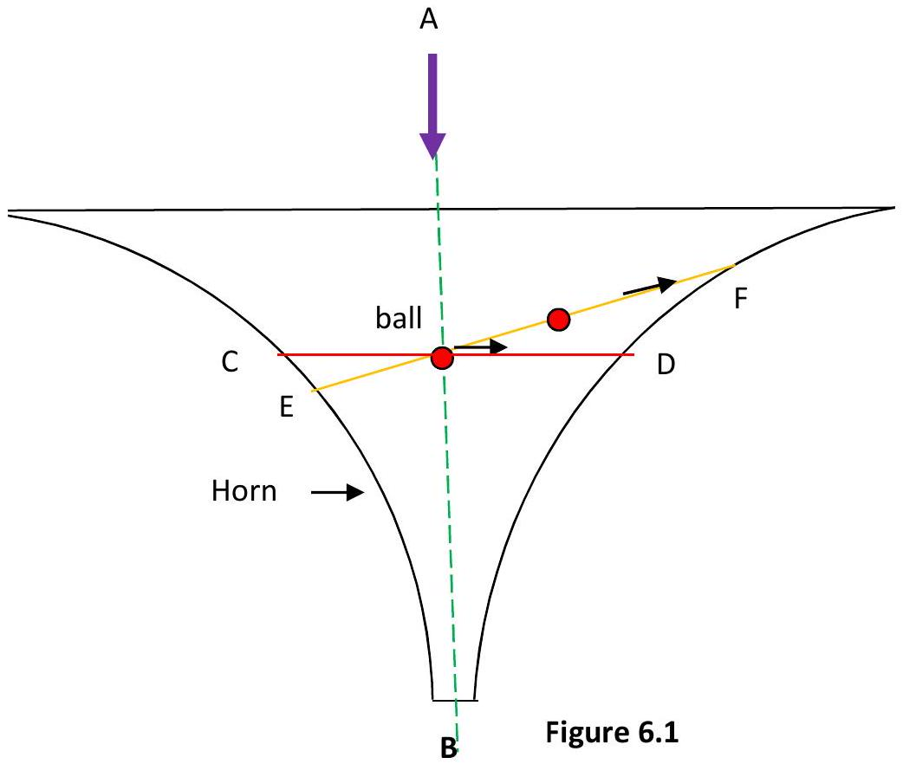
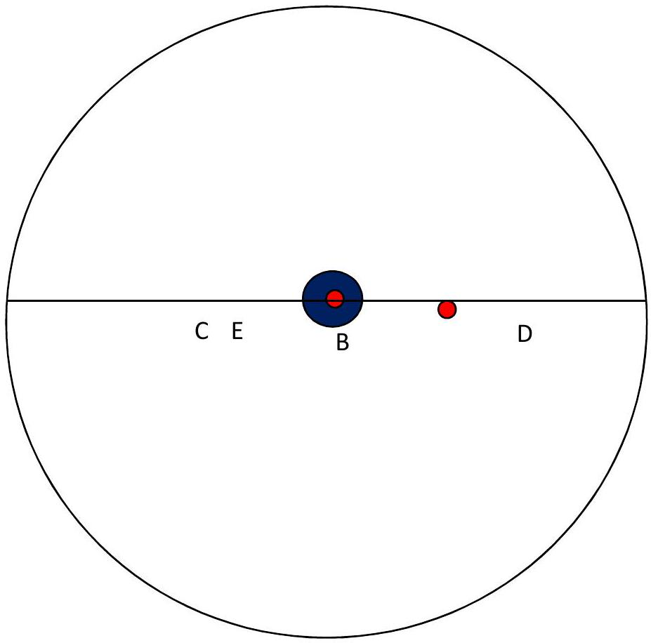

6.

Figure 6.2

Figure 6.1 shows a vertical cross section of a metal horn. A small red ball moves along a line that is horizontal and circular, C, D. However the ball could take the track E, F.

Discuss, using appropriate algebra where possible, the relative energies of the two tracks. How good a model is this of the solar system?
