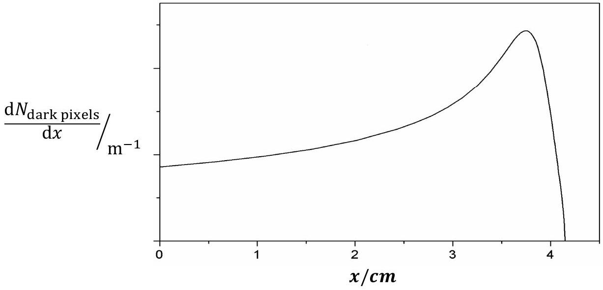

Qu 1.
In this question you are asked to make reasoned estimates, assumptions and explanations. These assumptions and estimations must be clearly stated.

(a)
    (i) The planet Venus orbits the Sun. Viewed through weak binoculars it appears to be crescent shaped. Its size and shape appear to change a few days later. Why is this?
    (ii) The planet does not appear to change in size and shape to the naked eye. However, its brightness does vary through its orbit. Why?
    (iii) It was realised in the $18{ }^{\text {th }}$ century that if two telescopes on different parts of the Earth measured the position of Venus at the same time, the distance from Earth to Venus could be measured and hence the scale of the Solar system (at that time, the radius of the Earth was well known). Why did they need to do this when Venus was in transit across the Sun?
(b) If a long hose is connected to a tap and the end of the hose is partially covered by a thumb, the water squirts out faster. Explain why.
(c)Alpha radiation from a source is observed in a cloud chamber and the tracks are photographed with a digital camera. The density of the track (number of dark pixels/per unit length, $\frac{\mathrm{d} N_{\text {dark pixels }}}{\mathrm{d} x}$ ) is plotted against the distance from the source, $x$. Explain the graph in Figure 1a.

Figure 1a. Range of alpha particles in a gas when emitted by a source.

(d) A beam of electrons is accelerated from rest by a pd of 1kV. The electric field is uniform. The beam current is $1 \mu \mathrm{~A}$ and the diameter of the cross section of the circular beam is 5 mm. Calculate:

(i) the maximum velocity of the electrons.
(ii) the velocity of the electrons after they had traversed half the distance in the field.
(iii) the magnetic field a distance of 5mm from the centre of the beam.
(iv) how does the magnetic field vary across the beam?
(v) how does this field effect the electrons?
