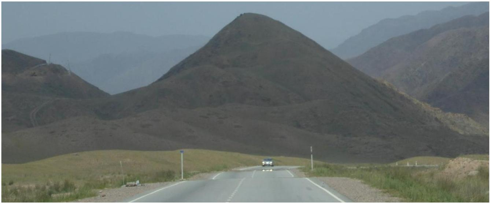

## Qu 3.

Figure 3a. Observation of a mirror-like effect.

Whilst travelling in the one of the Stans after the end of the 2014 Physics Olympiad in Kazakhstan, the author noticed what appeared to be pools of water on the road and that the headlamps of the approaching vehicle seemed to be reflected in the road. However, this was surprising since the air temperature was about 36 °C and it had not rained for some time. The refractive index of air at this temperature is about 1.0003.

Briefly account for this phenomenon by means of a description and a diagram. Then consider numerical values to explain the magnitude of the effect.

Marks will be given for the derivation of a formula that gives the geometric path of the light.

The refractive index of the air, $n(z)$, is linearly related to the absolute temperature of the air, which varies linearly with height, $z$. You may assume that the refractive index has the form

$$
n(z)=n(0)+\alpha z \quad \text { with, } \alpha z \ll 1
$$

( $z$ is not measured from the road level)
