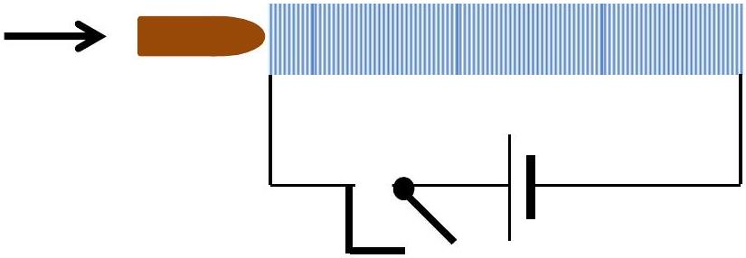

## Qu 4.

Figure 3a shows simplified design working of a magnetic rifle. The bullet is made of a magnetic material such as iron. The idea is that the trigger switches on the current, this draws the bullet into the solenoid and the bullet proceeds on its way. However trials showed that it did not work. Why do think this was so? Suggest modifications and explain as numerically as you can how your modifications would work.

Figure 4a. Magnetic rifle (schematic)
