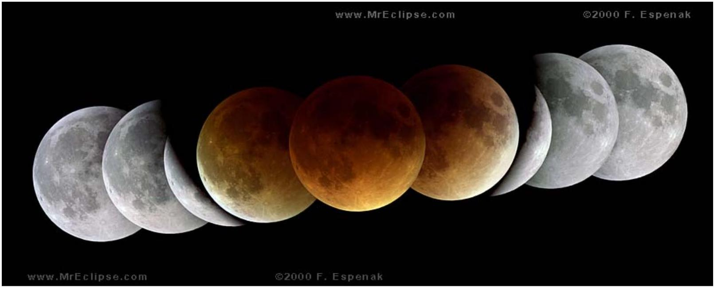

## Qu 5.

A lunar eclipse from the year 2000 is shown in Figure 5a below. The composite image is a set of nine separate images taken as a sequence over a period of three to four hours, and has been processed in Adobe Photoshop so that the moon's image is shown relative to the Earth's shadow. It shows various stages of the total lunar eclipse of Jan 20-21 2000, observed from Maryland in the United States. The three images of the moon at the centre of the composite are some 10000 times fainter than the surrounding images of the moon, and have been enhanced in this composite image. The reddening of the image is due to the scattering effect of light in the earth's atmosphere.
The angular diameter of the moon subtended at the earth is about 0.52°, whilst the angle subtended by the sun at the earth is on average about 0.53°.

Figure 5a. Composite image of a total lunar eclipse of January 21, 2000, oberved from Maryland USA over a period of three to four hours.

TLE2000umbra2w
http://www.mreclipse.com/LEphoto/TLE2000Jan/TLE2000Jan-1B.html
©2000 F. Espenak

The diameter of the earth is 6370 km and the sun is much larger, but at a very great distance away compared to the Earth-Moon distance. Using the information provided, estimate the distance from the Earth to the Moon.
Use sketch diagrams to show your method.

End of Questions
