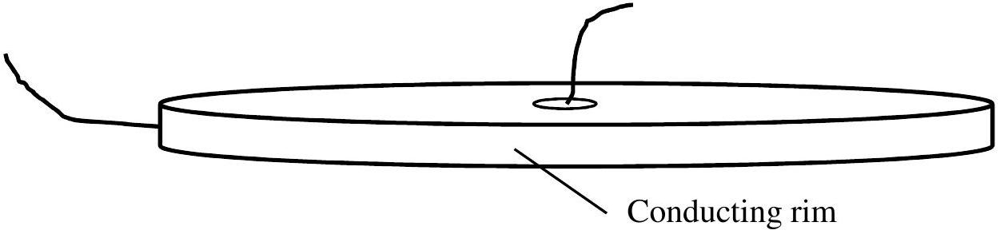
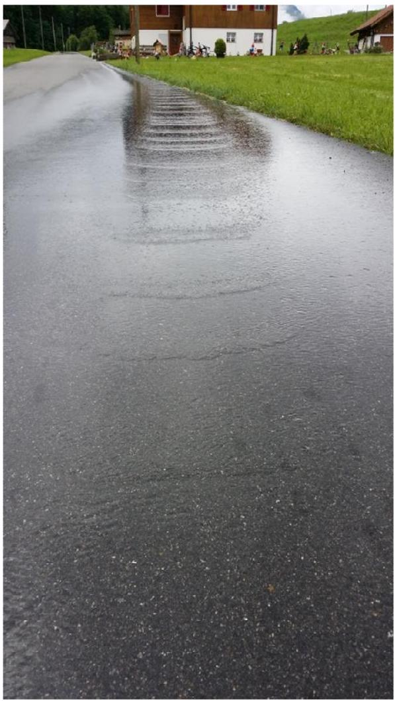
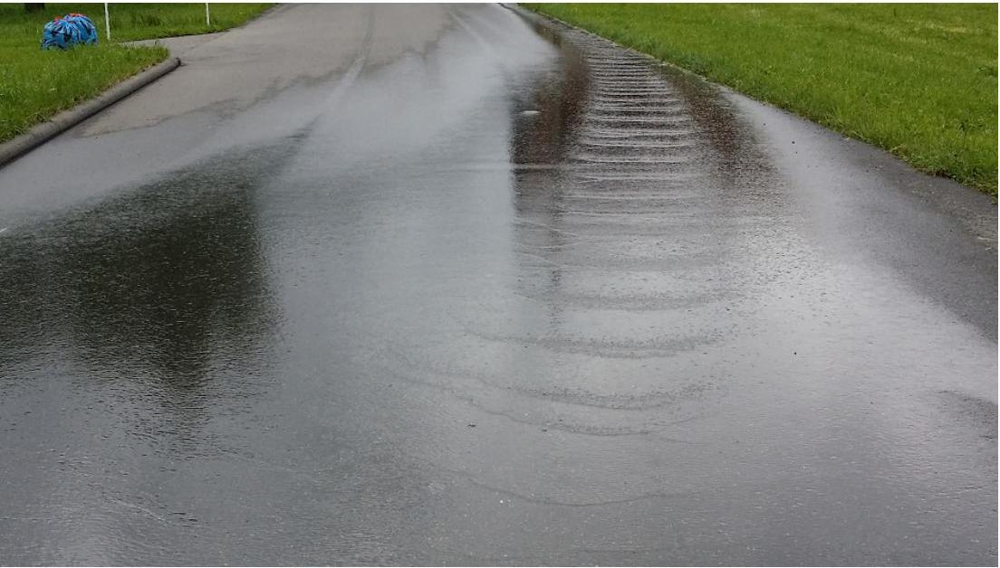

Question 1

(a) The flow of thermal energy through a conductor due to a temperature difference between two faces is described by an equation of the form,
$$
\frac{\mathrm{dQ}}{\mathrm{~d} t}=-\lambda A \frac{\Delta T}{\Delta x}
$$
in which $\frac{\mathrm{dQ}}{\mathrm{d} t}$ is the rate of heat flow, $A$ is the cross sectional area of the conductor, and $\frac{\Delta T}{\Delta x}$ is the temperature gradient along the line of heat flow. The thermal conduction properties of the medium are given by the coefficient of thermal conductivity, $\lambda$.
    i) A similar flow through a conductor may be ascribed to conduction of electricity. Write down an equation of the same form for electrical conduction through a material, stating what the corresponding term is in each equation.
Comment on the presence of the minus sign.
    ii) In an example in which two cylindrical conductors of heat energy with the same cross sectional areas and similar lengths are placed end to end in series, so that the thermal energy flows through each in turn, what is the equivalent thermal conductivity of the series combination of conductors, $\lambda$, in terms of $\lambda_{1}$ and $\lambda_{2}$ ? (No heat is lost through the sides of the conductors).
(b) A circuit is set up with the current flowing radially through a uniform disc of conducting material of resistivity, $\rho$, and thickness, $t$. Current enters a centre metal core of radius $r_{0}$ which has a very high conductivity and flows out of the rim of the disc, which has radius $r$, and has a ribbon of highly conducting metal around it. In terms of the linear dimensions and the resistivity, obtain an expression for the resistance through the disc.

Figure 1.1 Resistive disc with a current flowing radially from centre to edge, from the conducting metal centre core to the conducting metal rim.

(c) Physicists often have to explain effects seen in nature for which there may be a number of contributing explanations. Observation is a key skill of the physicist, being able to see what is in front of him and spot the important relevant features.

In Figures 1.2 and 1.3 below, water was seen flowing down a road from the constant source of a small stream at the side of the road. The smooth flow of the stream breaks up further up the road. The water flows down the uniform slope of the road towards the observer. State what you can observe in the photographs and comment on them from the point of view of a physicist. You are not required to do any calculations or explain all the physics of this complicated situation.

Figure 1.2 Flowing water on a shallow slope showing how the flow becomes uniform again when it spreads out.

Figure 1.3 Flowing water breaking up on a shallow slope.
