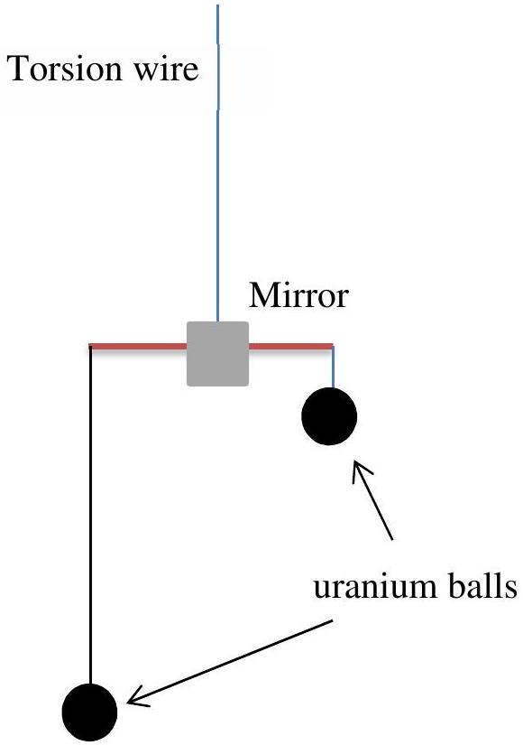
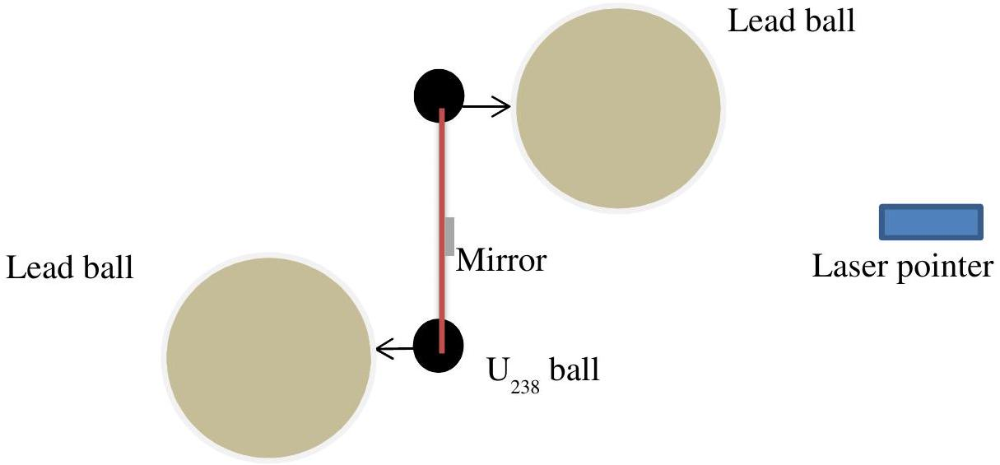
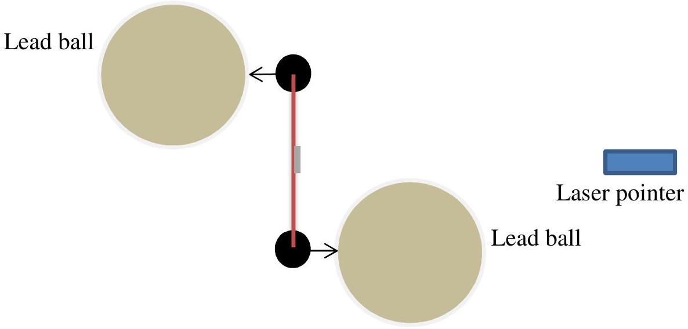

## Question 2

(a) The gravitational force of attraction, $F$, between two spherical masses $M_{1}$ and $M_{2}$ is given by
$$
F=\frac{G M_{1} M_{2}}{R^{2}}
$$
Measuring $G$ is difficult. Explain why.
(b)One of the earliest methods of measuring $G$ was devised by Henry Cavendish, and a modern version of the sort of setup he used is illustrated below.

Figure 2.1 Side-on view of apparatus for measuring G. Supporting bar with mirror attached.

Two equal, spherical uranium masses hang from the beam (at different heights). The apparatus is inside a draught proof container.

Two identical uranium spheres each of mass 60 g, made of depleted uranium-238, are suspended from a short, light, beam with a mirror attached. This is suspended from a thin torsion wire attached to a rigid support. The two small uranium spheres are hanging at different heights from the beam. Two massive lead balls (not shown) are placed on supports close to each of the uranium spheres, with about 1 cm separation between them. The uranium and lead spheres will not make contact when the beam is released. The lead spheres have a diameter of 7.6 cm and the length of the beam is 8.5 cm.

In Figure 2.2 the layout is now seen from above. This also shows the two large (grey) lead balls viewed from above. The pair of lead balls can be swung from position A as shown Figure 2.2, to position B as in Figure 2.3. The torsion wire supporting the mirror beam will resist twisting with a torque proportional to the angle of the twist, with the constant of proportionality being the torsion constant.

Explain how you could get the value of $G$ from this apparatus. Your answer should contain quantitative values as well as comments about the layout of the apparatus and a procedure for determining $G$. Consider estimating the torsion constant of the wire and the period of oscillation.

Figure 2.2 View from above. Two lead balls are placed near the two uranium masses suspended from the bar (position A)

Figure 2.2 The two lead balls swung into position B.

(c) If one of the large balls was moved, then the force on a small ball would change. It might be expected that the force, by similarity to light would propagate at the speed of light and like light photons, would be quantised (gravitons!).
Some years ago a flashing radio wave emitting source was observed by Jocelyn Bell, a PhD student at Cambridge, later Professor Bell and Chair of the BPhO. The team leader, Professor Anthony Hewish received the Nobel Prize in Physics for this discovery of pulsars. Sometime later the mass of the star was determined (the mass is about the same as the Sun but with a diameter of about 25 km), but since the star's surface could not be measured it was difficult to tell what exactly was happening. Binary pulsars have also been found (pulsars that rotate round a common centre of mass) and it is they that are likely to produce detectable changing gravitational fields.
Why would you think that binary pulsars might be a strong source of gravitational waves?
