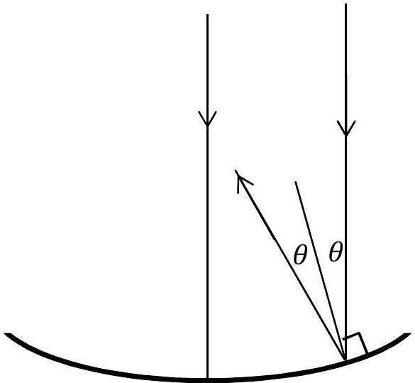

## Question 3

(a) Large area optical reflecting telescope mirrors are needed if we are to see further into the universe. Greater light gathering capacity and increased resolving power do, however, mean that the mirror supporting structure must be increasingly expensive. One way to overcome this is to rotate a circular tank of clean liquid mercury at a constant rate to create the correct shape of mirror. Obtain an expression relating the angular frequency of rotation, $\omega$, and the $x-y$ coordinates of the mercury surface.
(b)A telescope mirror in the shape of a parabola can be specified by the equation $y=a x^{2}$. A ray parallel to the axis of the mirror is shown in Figure 3.1 below, with the normal and the reflected ray. Obtain an expression for $\tan 2 \theta$ in terms of $a$ and $x$.
You may find useful: $\cos 2 \theta=\cos ^{2} \theta-\sin ^{2} \theta$ and $\sin 2 \theta=2 \sin \theta \cos \theta$

Figure 3.1 Parabolic mirror reflecting a paraxial beam of light. The normal to the mirror is shown.
(c) Show that the parabolic mirror will reflect all paraxial rays through a single focus, and determine the focal length of the mirror, $f$, in terms of $a$.
(d) The telescope is required to have a minimum resolution of (i.e. no worse than) 40 milliarcseconds in visible light. To avoid vibrations, the rate of rotation of the mercury mirror is a slow 8.5 revolutions per minute. If the mercury was rotated in a flat bottomed circular container with the same diameter as the mirror, estimate the minimum volume of mercury used to form the mirror.
(e) Mercury evaporates from the surface, as the molecules free themselves from the bulk of the liquid. The rate at which this happens is temperature dependent, but it is about $30 \mu \mathrm{~g}$ hour ${ }^{-1} \mathrm{~cm}^{-2}$. What fraction of the mercury mirror evaporates away in a week?
(f) The telescope mirror will focus light, but even for the ideal mirror shape, the light cannot be focused to a point. Explain why.
If the intensity of light reaching the telescope from a distant source is $8.0 \times 10^{-14} \mathrm{~W} \mathrm{~m}^{-2}$ (a rather faint telescopic 13.7 magnitude star), what is an estimate of the maximum intensity of light which is obtained at the image position?
