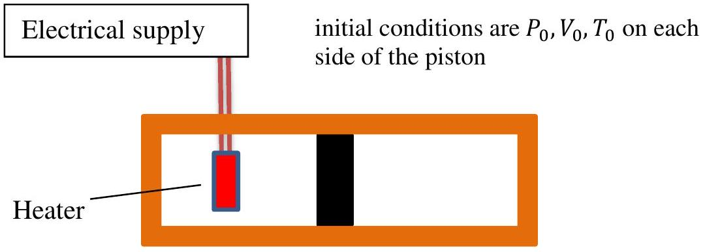

## Question 4

Figure 4.1 Cylinder with insulated walls and a moveable piston.

Figure 4.1 represents a cylinder with thermally insulated walls containing a movable, frictionless, thermally insulated piston. On each side of the piston are $n$ moles of an ideal gas. The initial conditions of pressure, $P_{0}$, volume $V_{0}$, and temperature $T_{0}$, are the same on both sides of the piston.
$C_{P}$ is the molar heat capacity (i.e. specific heat capacity per mole) of the gas at constant pressure and $C_{V}$ is the molar heat capacity (i.e. per mole) at constant volume.
The value of $\gamma$ is 1.5 where $\gamma$ is the ratio of the molar heat capacities, $\frac{C_{P}}{C_{V}}$.
By means of a heating coil in the gas on the left side of the piston, heat is supplied slowly to the gas on this side. It expands and compresses the gas on the right side until its pressure has increased to $\frac{27}{8} P_{0}$.

Hint: for a gas undergoing an adiabatic change, $P \times V^{\gamma}=$ constant, and also the ideal gas law still applies.

In terms of $n, R, C_{V}$, and $T_{0}$,

(a) how much work is done on the gas on the right side?
(b) what is the final temperature of the gas on the right?
(c) what is the final temperature of the gas on the left?
(d) how much heat flows into the gas on the left?
