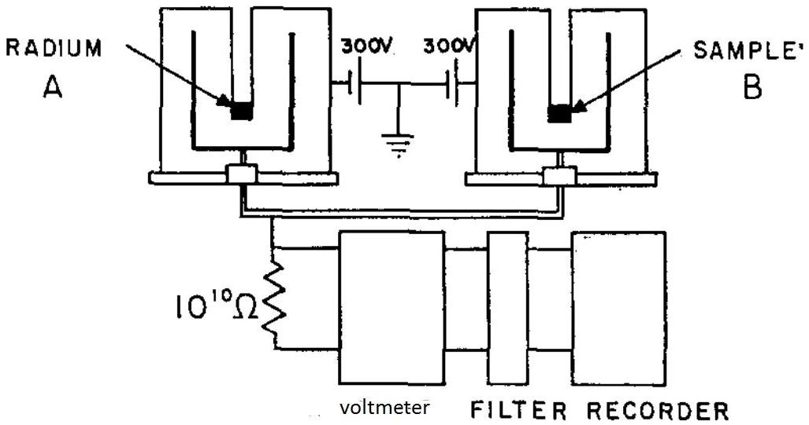

## Qu 3. Radioactive Decay

An ionization chamber is designed to measure the ion current from a radioactive gas. Initially the gas in the chamber is nitrogen. A small amount of Gas A is introduced into the chamber. It contains radioactive atoms which emit alpha particles with energy 6.5 MeV. It takes 15.6 eV to ionize a molecule of nitrogen.

(a) How many alpha particles per second does a current of $17 \times 10^{-9} \mathrm{~A}$ correspond to?
(b) Make an estimate of the expected variation in this current due to random variations in radioactive decay. Why do the current readings not show these variations?
(c) For accurate half-life measurements, a balanced ionization chamber apparatus has been used. This is shown schematically in Figure 3. The liquid sample of radium, whose half life is known accurately, and an unknown sample B are inserted in adjacent chambers. The voltage across a $10^{10} \Omega$ resistor is measured when it is attached to each chamber to measure the difference in current between them. The measurements go to a recorder. What advantages could there be in this experimental method and setup?

Figure 3: Schematic construction of a balanced ionization chamber apparatus. credit: Easterday H.T. and R. L. Smith: Nuclear Physics 20 (1960) 155-158

(d)After evacuation of the original ionization chamber, Gas B is introduced and the current measured. Gas B contains two radioactive isotopes, both emitting $\alpha$ radiation of the same energy as Gas A.

| Time /min | Current /nA |
| :--- | :--- |
| 0 | 17.000 |
| 1 | 14.930 |
| 2 | 13.261 |
| 3 | 11.912 |
| 4 | 10.820 |
| 5 | 9.934 |
| 6 | 9.212 |
| 7 | 8.622 |
| 8 | 8.137 |
| 9 | 7.737 |
| 10 | 7.404 |
| 11 | 7.126 |
| 12 | 6.892 |
| 13 | 6.692 |
| 14 | 6.521 |
| 15 | 6.372 |
| 16 | 6.242 |
| 17 | 6.126 |
| 18 | 6.022 |
| 19 | 5.927 |
| 20 | 5.841 |
| 21 | 5.760 |
| 22 | 5.685 |

Plot a graph of $\ln (I / \mathrm{n} A)$ against time (where $I$ is current) and explain its shape in as much detail as you can.
(e) Use your graph to determine the half-life of the longer lived isotope.
(f) Now use the results of these calculations to find the half-life of the shorter lived isotope.
(g) Gas B is removed before Gas C is introduced and the current measured. Gas C is identical to Gas B except that the decay product of the shorter lived isotope is itself unstable, emitting alpha particles of identical energy to Gases A and B. If S is the short-lived component of C, L is the long-lived component and X is the decay product of S, sketch graphs of $\ln (I / \mathrm{n} A)$ against time for the following cases. Indicate rough values on your graphs.
    (i) The half-life of X is less than the half-life of S.
    (ii) The half-life of X is greater than the half-life of L.
