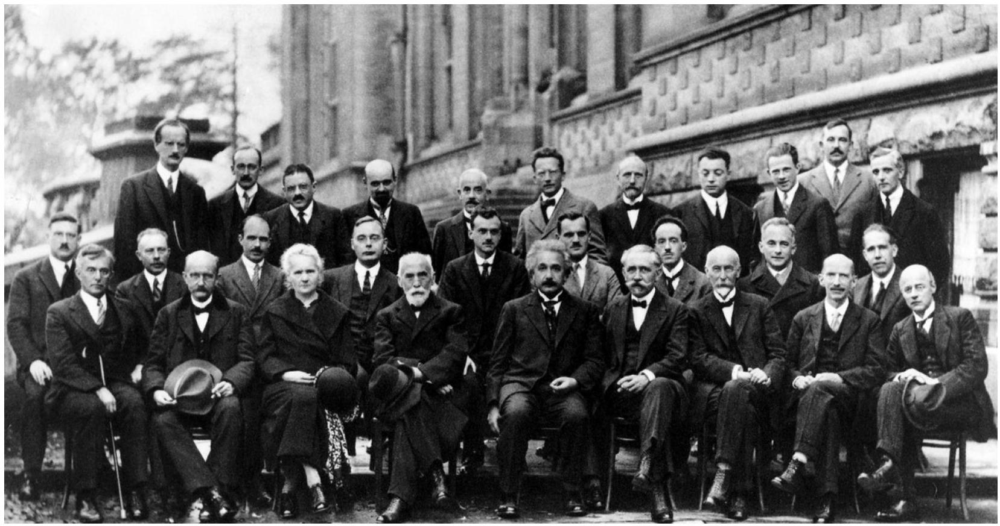
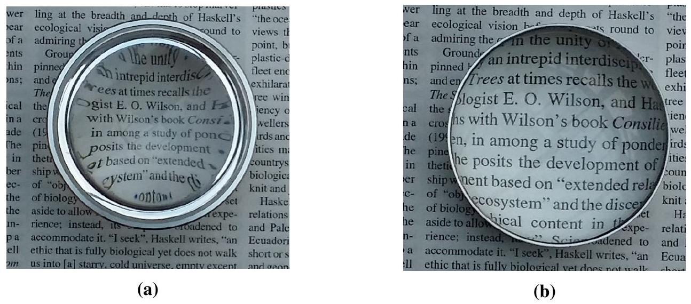
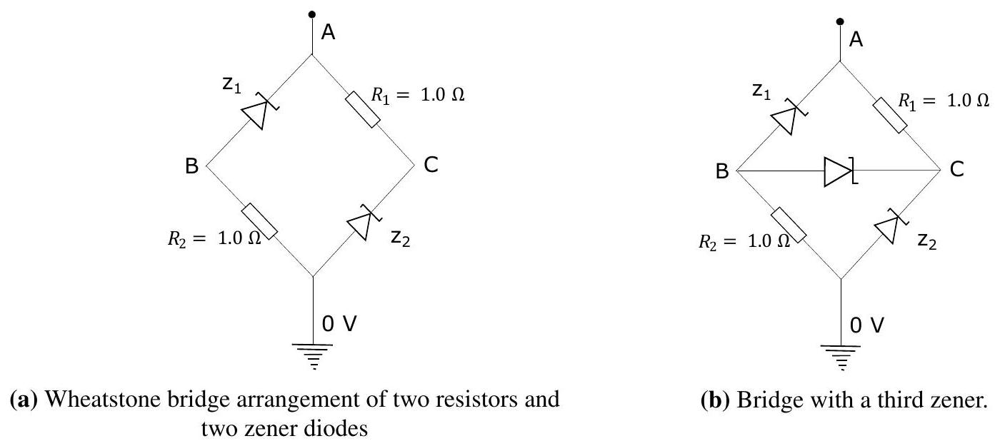
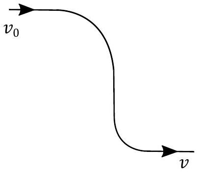

## Qu 1. General questions

(a) . In 1927 a famous conference on Photons and Electrons was held in Bruxelles, the $5^{\text {th }}$ Solvay Conference. The leading physicists of the day, in the rapidly developing field of Quantum Mechanics, attended. A photo of the conference delegates is shown in Figure 1 below. Write down as many names of the physicists from that era who you think might be in the photo. You may include relevant names, even if you may not be able to recognise them in the photo.

Figure 1: Physicists who took part in the $5^{\text {th }}$ Solvay Conference in Bruxelles 1927

(b). In Figs 2a and 2b are two pictures taken of the same lens resting on a sheet of newsprint. The camera used was held many focal lengths above the lens. What can you deduce about the lens from these observations. No calculations are required, but diagrams may be helpful.

Figure 2: Photos of each side of a single lens resting on newsprint.
(c) . Estimate the mass of a patch of mist which forms on a cold window when you breathe on it.

(d) . An interesting paradoxical two terminal circuit formed from passive components can be seen in the following example. Two $1.0 \Omega$ resistors and two 1.0 V zener diodes, $Z_{1}$ and $Z_{2}$, are connected in a manner known as a Wheatstone bridge, in Figure 3a. (A typical diode will not conduct in the reverse direction, but a zener diode will conduct in the reverse direction if the potential difference across it is greater than a specified voltage; e.g. an ideal 1.4 V zener diode will conduct perfectly in the forward direction, and will also conduct perfectly in reverse if the reverse the potential across it is greater than 1.4 V.)
    (i) In Figure 3a, a +2 V potential from a power supply is connected to point A. What current flows through each branch of the circuit down to earth?
    (ii) In Figure 3b, a $\frac{3}{8} \mathrm{~V}$ zener diode, $Z_{3}$, is connected as shown. The same +2 V potential from a power supply connected to point A . What current now flows through the left and right hand arms of the circuit (i.e. paths AB0 and AC0)?
    (iii) In Figure 3a, a power supply connected to the arrangement shown. A current of $\frac{1}{2} \mathrm{~A}$ flows into the circuit at A and flows down to earth. What are the potentials at points $\mathrm{A}, \mathrm{B}$ and C ?
    (iv) In Figure 3b, the $\frac{3}{8} \mathrm{~V}$ zener diode $Z_{3}$ is connected as shown. The current from the supply is maintained at $\frac{1}{2} \mathrm{~A}$. What are the potentials at points $\mathrm{A}, \mathrm{B}$ and C now?
    (v) Comment on what you might see as the paradox in this circuit.

Figure 3: Ref. Paradoxical Behaviour of Mechanical and Electrical Networks, Cohen JE, Horowitz P, Nature v352 Aug 1992 p699.

(e). A small bead of mass $m$ can slide along a loop of wire bent in the form of two 90° curves joined by a straight section, shown in Fig. 4. Gravity does not apply here. As the bead slides, it is only slowed down by a contact frictional force given by $F=\mu N$, where $N$ is the normal force as it goes round the curve. If the bead has an initial speed $v_{0}=1.4 \mathrm{~m} \mathrm{~s}^{-1}$ and $\mu=0.25$, what would be its speed $v$ after it exits the second bend in the wire? The radius of the bead is much smaller than the radius of a bend.

Figure 4
