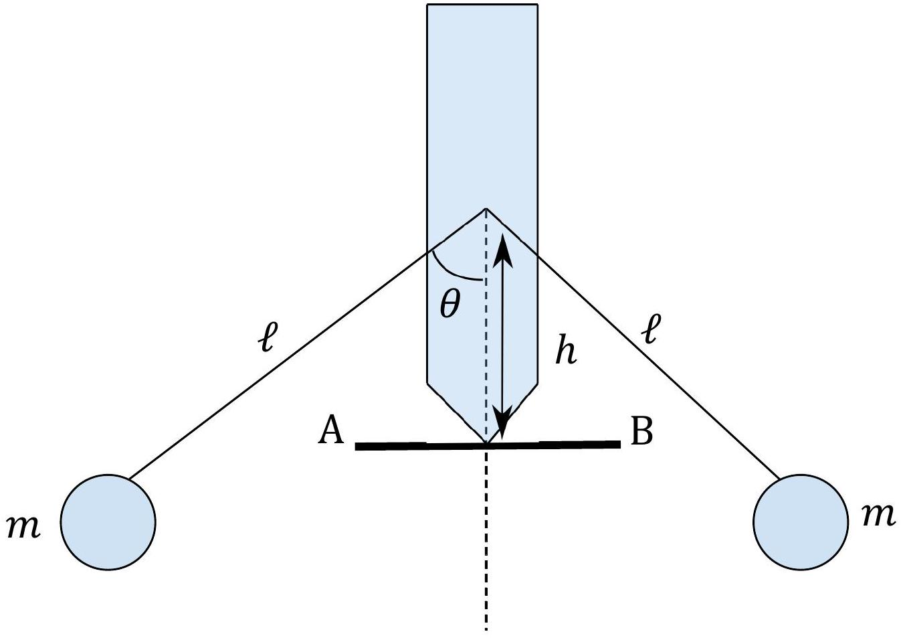

## Qu 2. Mechanical Toy

A simple balance toy is made as shown in Fig. 3. Two masses, $m$, are mounted at the end of symmetrical arms of length $\ell$ each at an angle $\theta$ to the body of the toy at a height $h$ above the pivot point. Initially we shall take the body of the toy to be of zero mass.

Figure 3

(a) . Taking the zero of potential energy as the point where the arms connect to the body of the toy, find an expression for the potential energy, $U$, of the system if the toy is tilted clockwise through an angle $\phi$. A diagram will be helpful.
(b) . For the system to be stable, we expect $\frac{\mathrm{d} U}{\mathrm{~d} \phi}$ to be zero. Find the angle for which this is true and explain why you reject other solutions.
(c) . Further, we require $\frac{\mathrm{d}^{2} U}{\mathrm{~d} \phi^{2}}$ to be positive.
    (i) Explain why the second derivative must be positive.
    (ii) Using this condition, explain where the masses must be relative to the toy for stability.
(d) . For a small sideways displacement of the point of contact, $\phi \approx x / h$. Use this and the small angle approximation to find the potential and kinetic energy of the toy in terms of $x$ and $\dot{x}$.
(e) . Compare your expressions to the equivalent terms for the potential and kinetic energies of a mass on a spring undergoing SHM. Explain why you would expect the toy to undergo SHM for small displacements. Using the expression for the angular frequency of a mass on a spring, $\omega=\sqrt{\frac{k}{m}}$, find an equivalent expression for the toy, by analogy.
(e) . Repeat the analysis but allow the body of the toy itself to have a mass $M$ and a centre-of-mass level with the point where the arms contact it. How will the new oscillation frequency compare with the previous one, assuming the system is still stable?
