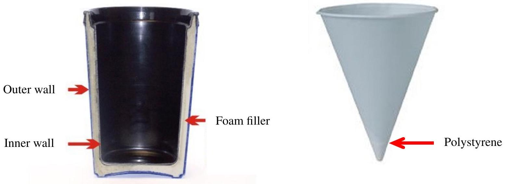

## Qu 3. Sisyphus's Coffee

Ben often drinks coffee, but finds that he rarely finishes his cup completely; the coffee is normally too cold by the end for him to drink it all up. This situation puzzles him and, as he is a physicist, he decides to model it. As the coffee cools to a more comfortable temperature, Ben can drink it faster, but when it goes below a critical temperature, $T_{F}$, it is too cold and he stops drinking it. He therefore models the rate of drinking as

$$
\frac{\mathrm{d} V}{\mathrm{~d} t}=-\frac{k}{T-T_{F}} \quad \text { for } \quad T \geq T_{F}
$$

where $V(t)$ is the volume and $T(t)$ the temperature at time $t . k$ is a positive constant parameterising how fast he is drinking.

(a) . Explain how Ben's model accounts for the variation in his rate of drinking and suggest, with reasoning, a value for $k$.
(b) . A picture of Ben's cup is shown below on the left. Identify and discuss the physical factors of the coffee and mug you would expect the rate of heat loss to depend on, and the relative contributions they might make. Express the rate of cooling as a function of these factors, defining any symbols that you use. Hint: assume the simplest reasonable dependence on the variables in question. You may also assume his mug is cylindrical.

Figure 4: Left: Ben's cup. Right: A cup Ben sees at a conference. Image credits: GAMA Electronics, Thermoserv mug, amazon.com (left); Hotpack, Paper Corn Cup, alibaba.com (right)

(c) . Show that Ben's model produces behaviour which accounts for his observations and estimate the amount of coffee he wastes with each mug he drinks, explaining your reasoning carefully. Hint: $\frac{\mathrm{d}^{2} V}{\mathrm{~d} t^{2}}=\frac{\mathrm{d} V}{\mathrm{~d} t} \frac{\mathrm{~d}}{\mathrm{~d} V}\left(\frac{\mathrm{~d} V}{\mathrm{~d} t}\right)$
(d) . Ben travels to a conference where he notices that, in an effort to get participants to drink their coffee up during the break, rather than taking it with them into the lecture theatre, it is being served in cups like the one on the right in the image above. The cups are made of polystyrene. Ben does not wish to accept a cup of coffee unless he is certain that he can drink it all up before it goes cold, otherwise he will be stuck with liquid in a cup and nowhere to put it. Explain whether or not you would advise him to accept a coffee. As a physicist, Ben will only be convinced by coherent quantitative reasoning.
