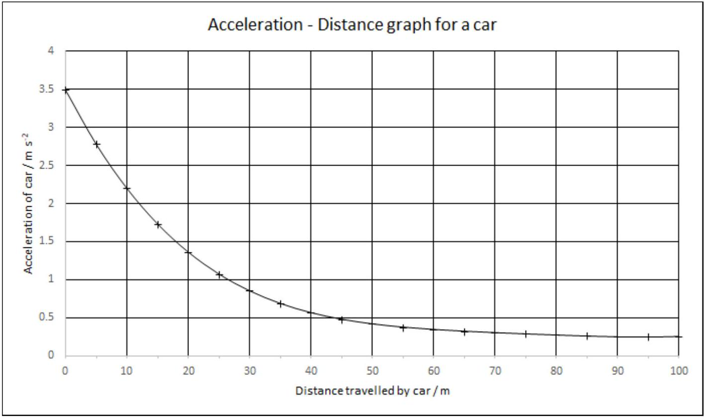

## Qu 1. General Questions

Write you answer starting on a new page for this question.

(a) For a modest temperature range, a sample of a metal in the form of a cube of side $\ell_{0}$ and volume $V_{0}$ at room temperature is heated by $\Delta T$. For small temperature changes, its volume expands by a temperature dependent factor such that $V=V_{0}(1+\gamma \Delta T)$, whilst its length expands linearly by a factor given by $\ell=\ell_{0}(1+\alpha \Delta T)$. If the expansion factors are both small, $\gamma=k \alpha$, where $k$ is a numerical factor. Derive a value for $k$.
(b) Two cells have e.m.f.s $\varepsilon_{1}$ and $\varepsilon_{2}$ and internal resistances $r_{1}$ and $r_{2}$.
    (i) What are the effective e.m.f.s and internal resistances when these cells are arranged:
        i. in series?
        ii. in parallel? (assume that the e.m.f.s and internal resistances are now the same)
    (ii) A cell has an e.m.f. of 1.0 V and an internal resistance of $50 \Omega$. How many of these cells, and in what arrangement, would be needed to power a 5.0 W, 6.0 V filament lamp?
(c)Shown in Figure 1 below is an image of an electrified fence with ice crystals on it. Give a physics explanation of this effect that you can see.

Figure 1: credit: AAPT 2013 High School Photo Contest

(d)An electric car carries an accelerometer which also records the distance travelled. A graph of the recording when the car starts from rest is shown in Figure 2. Estimate the velocity of the car after five seconds, and the power per unit mass which is used to accelerate the car at that moment.

Figure 2
