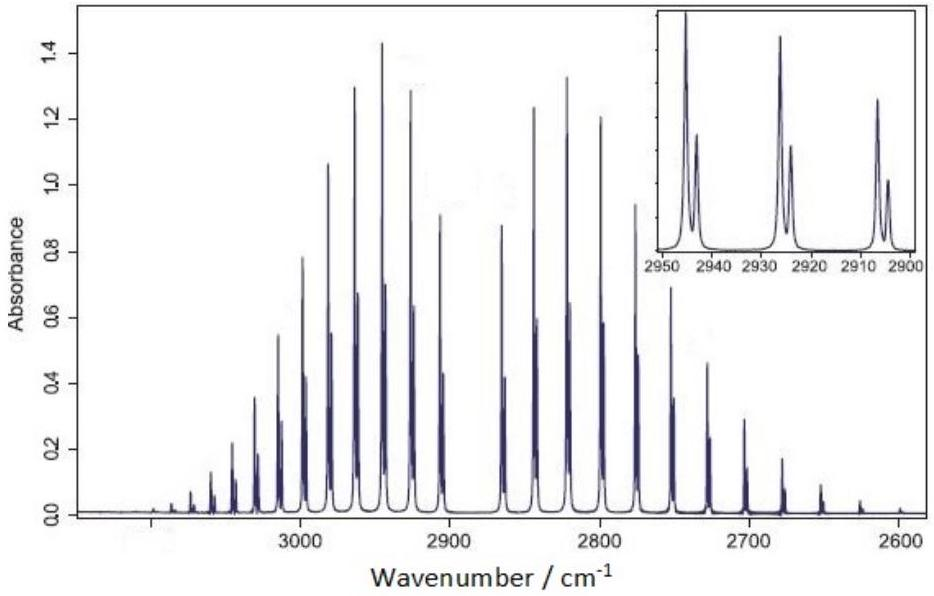
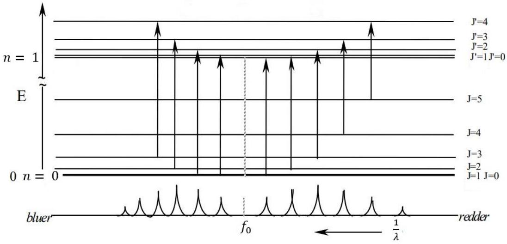

## Qu 2. The Atmosphere \& a Molecule

Write you answer starting on a new page for this question.
I The atmosphere
The atmosphere is composed of $78 \%$ nitrogen, $21 \%$ oxygen, $0.9 \%$ argon and about $0.1 \%$ trace gases. Water vapour varies between about 0\%-4\% depending on location and time of day.

(a) Consider a fluid at rest in a gravitational field $g$. Show that, if frictional forces within the fluid can be neglected, the pressure variation across a sufficiently small cube of incompressible fluid varies linearly with the height of the cube. This is referred to as hydrostatic pressure.
(b) In a simple model, the atmosphere is treated as an ideal gas.
    (i) Show that the variation in pressure with height is exponential. You may assume that the pressure variation across a very thin layer is hydrostatic, and that temperature is constant.
    (ii) Why is it safe to assume that $g$ is constant too?
    (iii) What do you think is the biggest issue with the formula found in (i)?
(c) In another model, the gas (still ideal) is assumed to expand adiabatically as it rises. An adiabatic change is one for which the pressure, $P$, of the gas and its volume, $V$, are related by $P V^{\gamma}=$ constant, where $\gamma=\frac{C_{P}}{C_{V}}$ with $C_{P}$ and $C_{V}$ the heat capacities of the gas per mole at constant pressure and volume respectively.
    (i) Find the rate of change of temperature with height, $\frac{\mathrm{d} T}{\mathrm{~d} h}$ - known as the temperature lapse rate - under these circumstances. You may assume without proof that $C_{P}=$ $C_{V}+R$ with $R$ the molar gas constant.
    (ii) Hence or otherwise find a more realistic formula for the pressure variation with height in the atmosphere.

II Spectra of molecules
A diatomic molecule can store energy in the form of vibration and rotation of the molecule. The energies can be shown to be quantised i.e. there are discrete energy levels similar to the energy levels encountered in the visible spectrum of an atom.

(d) An HCl molecule can be modelled as two masses, $m_{1}$ and $m_{2}$ with mean separation $\ell$ at the ends of a stiff spring, with spring constant $k$, representing the bond. The frequency of vibration can be expressed in terms of $k$ and $\mu$, where $\mu\left(m_{1}, m_{2}\right)$ is function of $m_{1}$ and $m_{2} . \mu$ has dimensions of mass and is known as the reduced mass. By considering the centre of mass of the system or otherwise, derive an expression for the frequency of vibration $f$ of the masses on the spring in terms of $m_{1}$ and $m_{2}$ and $k$. Hence write down the expression for $\mu$.

The IR spectrum of HCl is shown in Fig. 3. The wavenumber on the horizontal axis is $1 / \lambda$ measured in $\mathrm{cm}^{-1}$. A low pressure gas of HCl is illuminated with IR radiation and the absorption measured over a range of frequencies. The HCl molecule will rotate corresponding to a number of close, discrete energy levels designated by the letter $J=0,1,2,3 \ldots$ shown in Fig. 4. The two vibrational energy levels labelled with $n=0$ and $n=1$ correspond to a very much larger energy level difference.

Figure 3: IR spectrum of HCl. The inset shows the effect of the Cl-35 and Cl-37 isotopic mass difference. Credit Azo Materials https://www.azom.com/article.aspx?ArticleID=15226

Figure 4: Energy level diagram for HCl. Two vibrational energy levels are shown ( $n=0$ and $n=1$ ). The rotational energy levels are designated by the $J$ values, with the $J=0$ and $J=1$ levels very close together and shown as a thick line. Only transitions corresponding to $\Delta J= \pm 1$ are allowed. Credit https://www.colby.edu/chemistry/PChem/lab/VibRotHClDCl.pdf; Vibration- Rotation Spectroscopy of HCl and DCl

(e) For the wavenumber value $2900 \mathrm{~cm}^{-1}$ calculate the energy $E$ of the transition and calculate the corresponding temperature using $E=k_{\mathrm{B}} T$.

Only transitions between states corresponding to $\Delta J= \pm 1$ are allowed. So the $\Delta J=0$ transition is missing. In Figs. 3 and 4 the set of transitions in which the upper level has the higher $J$ is called the $\mathbf{R}$ branch, while the $\mathbf{P}$ branch has this reversed. The transitions within a branch are labeled by the $J$ of the lower level; $\mathbf{R}(\mathbf{0}), \mathbf{P}(\mathbf{1})$ would be the labeling for the lowest $J$ transitions.

(f) Draw a labelled energy level diagram, similar to Fig. 4, showing the first five rotational levels in the ground and first vibrational states $(n=0 \rightarrow 1)$. Show, using arrows as in Fig. 4, all of the transitions allowed between these states (and only these transitions), and label each transitions with the $\mathbf{P}, \mathbf{R}$ notation.
(g) An estimate of the $J=0$ transition energy can be obtained from the average of the $\mathbf{R}(\mathbf{0})$ and P(1) transition energies. If this corresponds to $8.66 \times 10^{13} \mathrm{~Hz}$, using your result from (d), calculate the value of the spring constant $k$ for the HCl bond.
Data: Atomic mass of hydrogen is 1.0078 u Atomic mass of chlorine-35 is 34.9688 u
