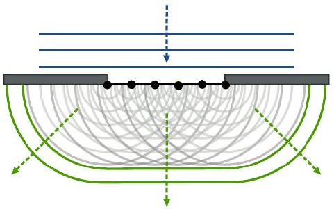
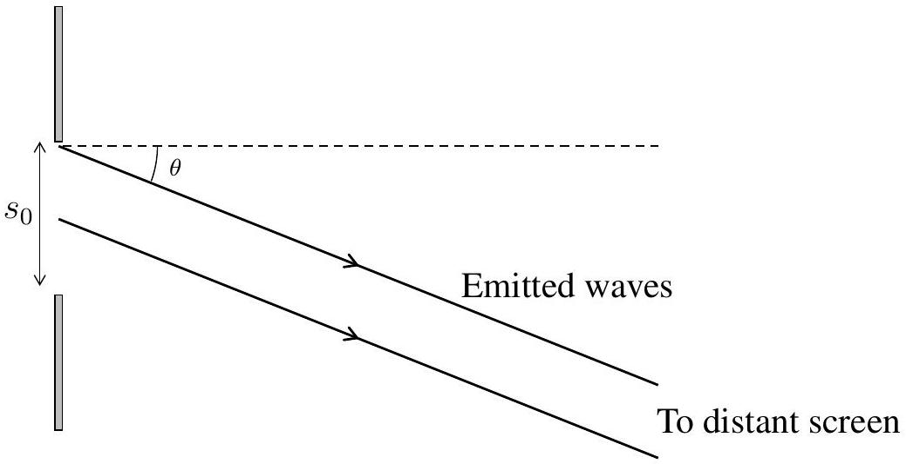

## Qu 3. Diffraction

Write you answer starting on a new page for this question.
Huygens's wave theory states that each point on a wavefront can be treated as a secondary point source. A wavelet (a circular ripple) spreads out from each point and the new wavefront is formed by drawing a smooth line through all the fronts of these wavelets (an envelope enclosing all the wavelets). i.e. the superposition of all the smaller diverging wavelets emitted by the oscillating particles will form a new wavefront. This is illustrated in Fig. 5 below.

Figure 5: A set of points on a wavefront acting as sources for secondary wavelets with an envelope constructed to form a new wavefront.
Credit By Arne Nordmann (norro) - Own illustration, CC BY-SA 3.0, https://commons.wikimedia.org/w/index.php?curid=1944668

(a) Consider light diffracting through a single slit of width $s_{0}$ which is illuminated by a plane wavefront of uniform intensity and at normal incidence. We can determine the positions of the minima in a single slit pattern incident on a distant screen by considering the plane wavefront entering the slit to be constructed of a very large number of secondary points sources, each emitting circular wavelets (of light). In Fig 6 are shown two "emitted waves".
    (i) Comment on the relation between these two rays and the secondary sources in the slit emitting wavelets.
    (ii) At a certain angle, the path difference between rays emitted from the centre of the slit and the edge of the slit is $\lambda / 2$. Explain why the intensity of light falling on the screen in this direction is zero.

    (iii) By splitting the slit into 1,2,3,... parts and pairing up the rays, deduce all angles, $\theta$, for which the intensity of light falling on the screen is zero.

(iv) For a screen a distance $D$ away, where $D \gg s_{0} \gg \lambda$, deduce the fringe spacing of the diffraction pattern and the width of the central maximum.
(b) Finding the intensity of light on the screen as a function of angle $\theta$.
    (i) Explain why the total (superposed) wave emitted by the slit at any angle will oscillate in phase with the wave travelling from the point at the very centre of the slit.
You might consider the secondary sources in the slit emitting waves which have the form of $A \cos (\omega t+\phi(\delta s))$ where $\phi(\delta s)$ represents the phase of a wave emitted from a point a distance $\delta s$ from the centre of the slit and in the plane of the slit.
    (ii) Consider a wave incident on the slit with an amplitude dependent upon $\delta s$, taking the form $A(\delta s)=\frac{A_{0}}{s_{0}} \delta s$, where $A_{0}$ is the amplitude at the centre.
        i. Sketch a graph of the amplitude of the wavefront from one side of the slit to the other.
        ii. Sketch a graph of the intensity of the wavefront from one side of the slit to the other.
        iii. Now taking a fixed amplitude $A_{0}$ across the slit, independent of $\delta s$, Show that the intensity of radiation as a function of $\theta$, where $\theta$ is the angle measured from the centre line normal to the slit, is given by
$$
I(\theta)=I(0) \frac{\sin ^{2}\left(\frac{\pi s_{0}}{\lambda} \sin \theta\right)}{\left(\frac{\pi s_{0}}{\lambda} \sin \theta\right)^{2}}
$$
Hint: Choose a point in time when the 'height' of the wave emitted from the centre of the slit is maximised.
The limit of $\frac{\sin ^{2} x}{x^{2}}$ for $x=0$ is 1 .
(c) Numerical results for $I(\theta)$.
    (i) Light from a red laser of wavelength 628 nm is normally incident on a single slit of width $20 \mu \mathrm{~m}$ after which the light strikes a screen 1.00 m away. Find the distance, on the screen, from the centre of the diffraction pattern to the brightest point of the first order maximum.
Hint: The brightest spots are not directly in the middle of the two adjacent minima. You may assume that the first non-zero positive solution to the equation $x=\tan x$ is, to four significant figures: $x=4.4934$
    (ii) Find the ratio between the zeroth and first order maxima. At which order maximum does this ratio fall below 1\%?
Hint: Assume that for $n \geq 2$ the brightest point of a maxima falls roughly in the middle of the adjacent minima.
