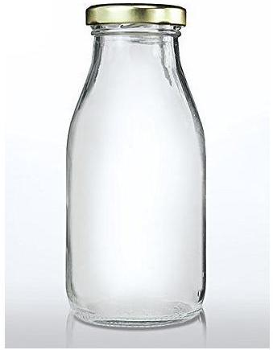

## Qu 1. General Questions

(a)The bottle below is filled to the brim with salad dressing made from oil and vinegar. The bottle is shaken before being left to stand, whereupon it is observed that the oil slowly separates and rises to the top. Is the pressure on the bottom of the bottle now the same, greater or less than before? Explain your reasoning carefully.

Figure 1: Credit IndiaMART Glass 200ml Milk Bottle

[5]
(b)Table 1 shows the timetable of a passenger boat on the River Rhine.

| Time | Town | Time | Town | Position along the river /km |
| :--- | :--- | :--- | :--- | :--- |
| 1700 | St Goarhausen | 1851 | St Goarhausen | 642 |
| 1830 | Bacharach | 1801 | Bacharach | 659 |

Table 1: Rhine cruise timetable

Obtain a numerical estimate of the speed of the Rhine current and the speed of the boats in still water. N.B. the position markers follow the river Rhine, indicating the distance along its course from a zero marker.
[5]
(c) Estimate the work done in inflating a bicycle tyre. Provide your own approximate data and work in SI units.
[5]
(d) A sodium salt is heated in a flame at a temperature of 1500 K and the sodium line of wavelength 590 nm is observed. Calculate the spread of wavelengths assuming that all the molecules move with the same speed.
Mass number of sodium is 23 .
[5]
(e) A thick walled flask has an outer surface which is a sphere of radius 10 cm and an inner surface which is also spherical and concentric with the outer. When it is filled with an opaque liquid and held up against a diffuse source of light, the flask looks black all over. Is the flask able to contain 1 litre of liquid?
1 litre $=1000 \mathrm{~cm}^{3}$
[5]

[25 marks]
