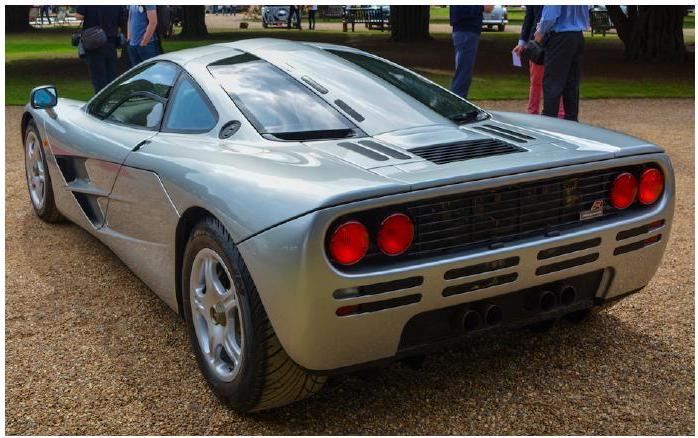
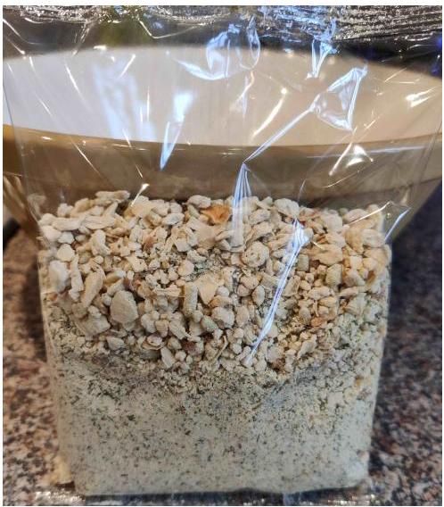

## Qu 1. General Questions

You are expected to write clear physics, to suggest a model, and to suggest ideas for these effects in Q1. You may find it helpful to bullet point your answers.

(a)In 1998 the McLaren F1 became the world's fastest production car, achieving a top speed of 240 miles per hour. If the maximum useful power developed by the engine is 461 kW , estimate the drag coefficient of the McLaren F1. The drag force is proportional to $v^{2}$, the cross-sectional area of the car, and the density of air. The drag coefficient is then the constant of proportionality.

Figure 1: McLaren F1 sports car. Credit: Craig James (en.wikipedia.org/wiki/McLaren_F1)
(b) A resistance $R$ is placed in series with an alternating voltage source, of negligible internal resistance, which has an amplitude $V_{0}$ and frequency $f$. Determine an expression for the average power dissipated by the resistor. If the source can supply a total energy $E$, calculate how long the source lasts before being drained.
(c)A bag of dried sage and onion stuffing is unpacked from its box. It consists of dried organic particles of a range of sizes. On examination it is seen that the larger particles in the mixture are on top. Suggest, based on your knowledge of physics, why this might be so.

Figure 2: A bag of dried sage and onion stuffing. Credit: James Bedford
(d) A car is left outside overnight in the cold when there is a frost (below zero). Explain why the glass front windscreen of the car can form a thicker layer of ice, compared to that on the side windows of the car.
