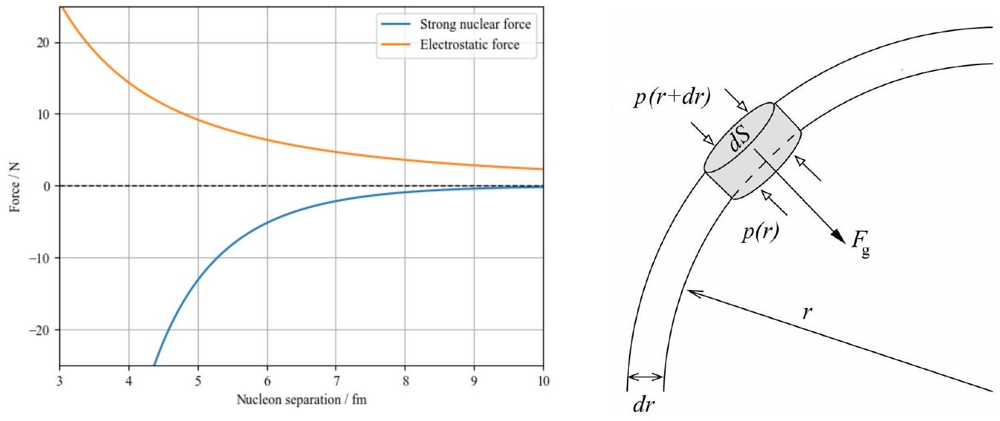

## Qu 2. Stellar Interiors

This question explores nuclear fusion and the interior structure of stars.

Figure 3: Left: Forces between two protons. Right: Fluid parcel within a spherical shell. Credit: Rupert Allison

(a) As shown in Figure 3, two protons separated by 7 fm experience a mutual electrostatic repulsion of about 5 N. Verify this fact by calculation.
(b) Make a rough copy of the graph of Figure 3 and add your own sketch to it to show the resultant force between two protons, as a function of their separation. Explain why very high temperatures are required for fusion to occur. Hence estimate the minimum temperature for proton-proton fusion to occur.
(c) Suggest why your answer to part (b) is likely to be an overestimate.
(d) The gravitational field strength within a star is given by $g(r)=-G m(r) / r^{2}$, where $m(r)=$ $\int_{0}^{r} 4 \pi r^{\prime 2} \rho\left(r^{\prime}\right) d r^{\prime}$ is the mass enclosed at radius $r$ and $\rho(r)$ is the gas density, i.e. the force of attraction at radius $r$ is only due to the mass of the sphere that lies within radius $r$. By considering the forces on the fluid parcel indicated in the right-hand panel of Figure 3, show that the pressure gradient within a star in hydrostatic equilibrium is given by
$$
\frac{d p}{d r}=\rho(r) g(r)
$$
and thereby argue that the pressure decreases with increasing radius throughout the star.
(e) The Sun has mass $M=2 \times 10^{30} \mathrm{~kg}$ and radius $R=7 \times 10^{5} \mathrm{~km}$. By taking crude averages (across the whole star) for each of the quantities in Eq. 1, estimate the pressure and temperature of the Sun's core. Is it plausible that the Sun is powered by nuclear fusion? Do protons move relativistically in the Sun's core?
(f) Modelling the Sun with the following density profile, determine more careful estimates for the pressure and temperature at the Sun's core:
$$
\rho(r)=\rho_{0}\left(1-\frac{r^{2}}{R^{2}}\right)
$$
where $\rho_{0}$ is the density at the Sun's core.
(g) Almost all stars we observe have a mass $M$ in the range $0.1 M_{\odot}<M<100 M_{\odot}$, where $M_{\odot}$ is the mass of our Sun. Suggest an explanation for this.
