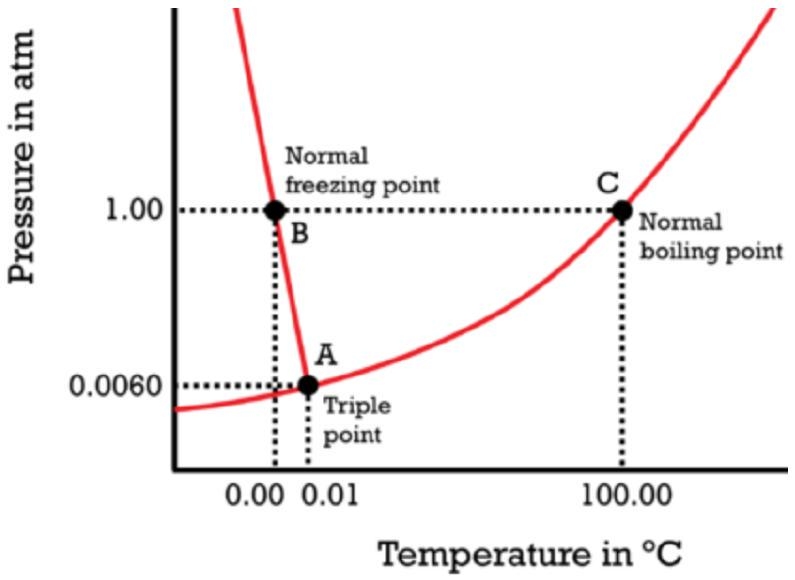
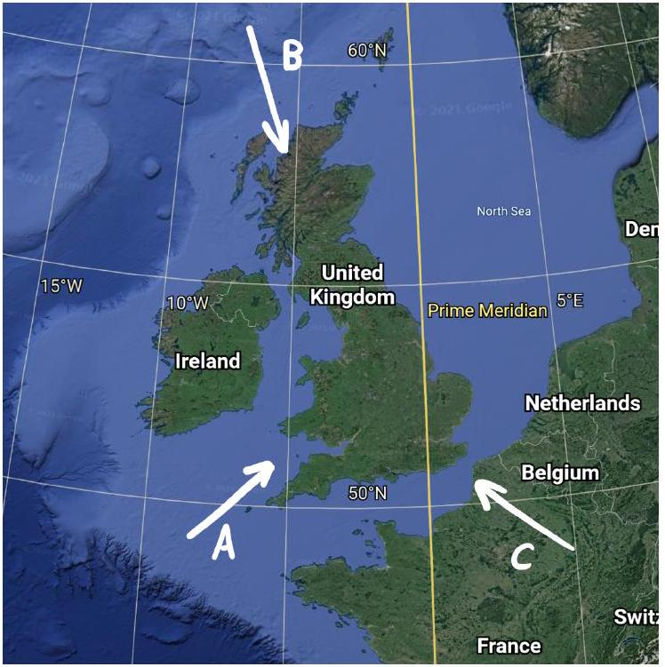

## Qu 4. Cloud Physics

This question explores the formation of clouds in the lower atmosphere.

(a) Consider a sealed flask, connected to a pressure gauge, containing dry air (no water vapour) at atmospheric pressure. A small volume of liquid water is injected into the flask.
    (i) With reference to evaporation and condensation, explain why the pressure inside the flask is observed to increase over time, then eventually level-off.
    (ii) The flask is now cooled externally. With the aid of a sketch graph, explain qualitatively the subsequent readings on the pressure gauge.

Figure 5: Phase diagram for water. Credit: Adapted from courses.lumenlearning.com/cheminter/chapter/phase-diagram-for-water

Figure 5 shows the so-called phase diagram of water.

(b) Sketch out the phase diagram on your answer sheet and mark the regions showing the three possible phases - solid, liquid and vapour - with the letters the $S, L$ and $V$ respectively. Now add arrows to indicate the names of the variety of different phase transitions possible, e.g., melting from $S$ to $L$.

The coexistence curve $A-C$ shows the possible combinations of pressure $p$ and temperature $T$ for which water exists in equilibrium as a mixture of liquid and vapour phases.

The Clausius-Clapeyron equation describes the gradient of this co-existence curve:

$$
\frac{d p}{d T}=\frac{L M p}{R T^{2}}
$$

where $L=2.50 \times 10^{6} \mathrm{Jkg}^{-1}$ is the specific latent heat of vaporisation of water, $M$ is the molar mass of water and $R$ is the molar gas constant. At any given temperature $T$, the equilibrium pressure exerted by water in its vapour phase is called the saturation pressure, $p_{\text {sat }}(T)$.

(c) Using the triple point $A$, indicated on Figure 5, to provide the relevant initial conditions, show that:
$$
\ln \left(\frac{p_{\mathrm{sat}}}{p_{0}}\right)=\frac{L M}{R}\left(\frac{1}{T_{0}}-\frac{1}{T}\right)
$$
where $p_{0}$ and $T_{0}$ are the pressure and absolute temperature at the triple point, respectively.
(d) Calculate the saturation pressure of water at 20°C.

Our atmosphere can be effectively modelled as an air/water-vapour mixture of ideal gases. The contribution to the total atmospheric pressure due to the water vapour is called the partial pressure of water, denoted $p_{\mathrm{w}}$.

The relative humidity $\phi$ of a parcel of air is defined as the ratio of the partial pressure of the vapour to the saturation pressure, with all quantities evaluated at the temperature of the parcel:

$$
\phi(T)=\frac{p_{\mathrm{w}}(T)}{p_{\mathrm{sat}}(T)}
$$

(e) With reference to Eq. 6, explain what happens to the relative humidity of an air parcel that rises from the Earth's surface and hence explain how convective clouds form in the lower atmosphere.

For the rest of the question, take the air at sea level to be at $20^{\circ} \mathrm{C}$ and $35 \%$ relative humidity.

(f) Calculate the partial pressure of water vapour in air at sea level. Hence determine the number of water molecules in $1 \mathrm{~m}^{3}$ of air under these conditions.
(g) Determine the mass fraction of water in the air, making assumptions about the chemical composition of the atmosphere.
(h)Use the following atmospheric data to estimate the altitude at which cloud formation will occur.

| Altitude / m | Atmospheric pressure / atm | Temperature / °C |
| :--- | :--- | :--- |
| 0 | 1.00 | 20 |
| 750 | 0.92 | 15 |
| 1500 | 0.84 | 6 |
(i) Using your understanding developed in the previous parts of the question, and without calculation, suggest the probable atmospheric conditions in Britain when air approaches from each of the three directions, A, B and C, indicated in Figure 6.

Figure 6: Wind directions for Q4(i). Credit: Adapted from Google Earth.

## END OF PAPER

Questions proposed by:
Rupert Allison, Harrow School
James Bedford, Harrow School

